# 年会抽奖系统 - SaaS 架构重构设计

## 设计目标

将现有单页面抽奖系统重构为前后端分离的多租户 SaaS 服务，保持核心抽奖功能和用户体验不变，增强数据持久化、多租户隔离、用户权限管理能力。

## 核心原则

- 保持原有纯前端滚动抽奖体验，后端仅负责数据持久化
- 租户间数据完全隔离，采用独立 Schema 方案
- 支持租户内多角色权限管理
- 所有业务数据持久化到 PostgreSQL，支持历史数据查询
- Redis 用于会话管理和缓存优化

## 系统架构概览

### 整体架构

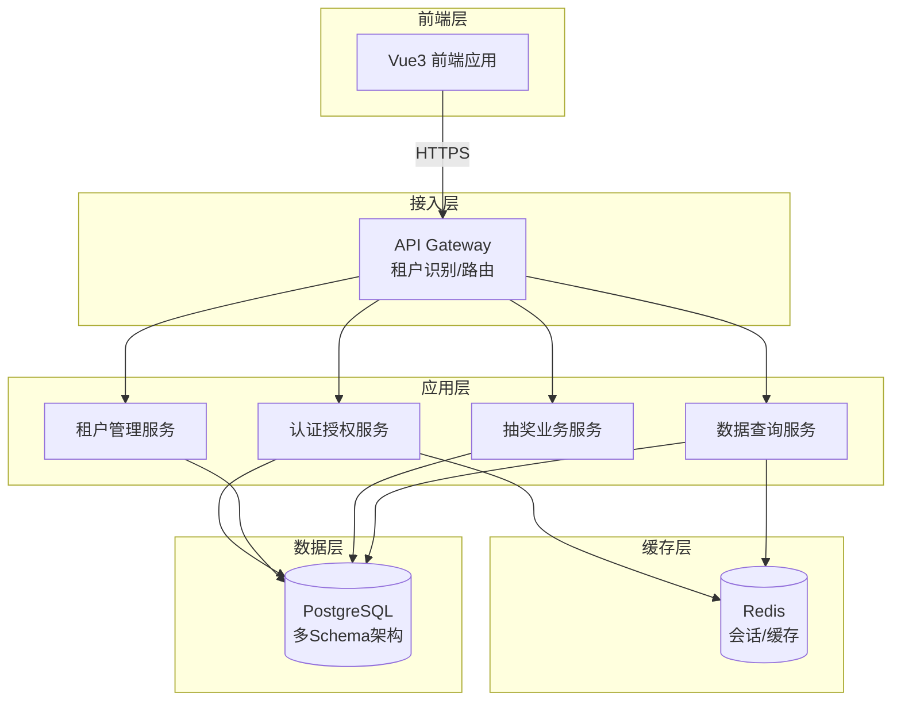

### 技术栈选型

| 层级 | 技术选型 | 用途说明 |
|------|---------|---------|
| 前端框架 | Vue 3 + Vite | 现代化前端开发体验，组件化开发 |
| UI 组件库 | Element Plus | 企业级组件库，快速构建管理界面 |
| 状态管理 | Pinia | Vue 3 官方推荐的状态管理方案 |
| 前端路由 | Vue Router | 单页面应用路由管理 |
| HTTP 客户端 | Axios | HTTP 请求封装，拦截器支持 |
| 后端框架 | Spring Boot 3.x | 成熟的企业级 Java 框架 |
| 数据访问 | MyBatis-Plus | 简化数据库操作，支持动态 Schema |
| 数据库 | PostgreSQL 15+ | 原生支持 Schema 隔离，JSONB 类型 |
| 缓存 | Redis 7.x | 会话存储、热点数据缓存 |
| 安全框架 | Spring Security + JWT | 认证授权，无状态会话 |
| API 文档 | Knife4j | Swagger 增强版，接口调试 |

## 多租户架构设计

### 租户隔离策略

采用 **独立 Schema** 方案，在同一 PostgreSQL 数据库实例中为每个租户创建独立的 Schema，实现数据隔离。

**架构特点**：
- 成本适中：共享数据库实例，降低基础设施成本
- 隔离性强：Schema 级别隔离，避免数据混淆
- 管理便捷：统一备份恢复，集中运维管理
- 扩展灵活：支持后续按需迁移到独立数据库

### 租户识别机制

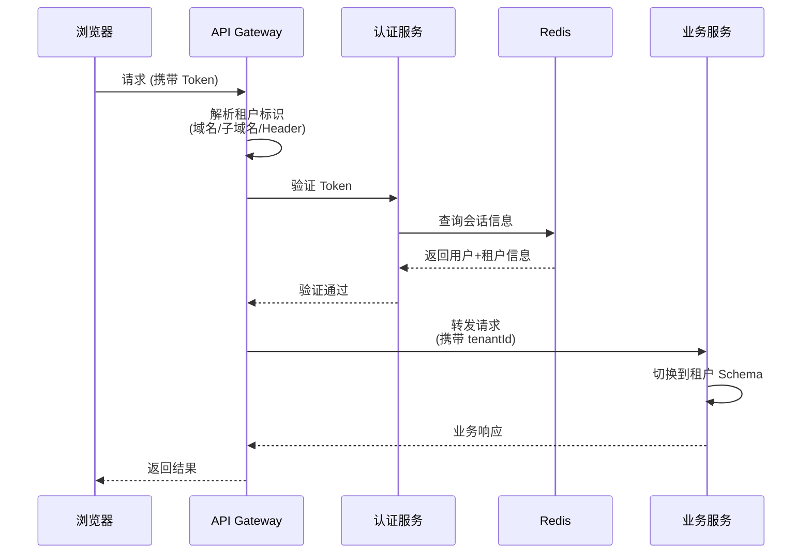

**租户识别方式**（按优先级）：
1. 子域名识别：`tenant1.lottery.com`，`tenant2.lottery.com`
2. HTTP Header：`X-Tenant-Id: tenant-uuid`
3. JWT Token 中携带租户 ID

### Schema 动态切换

每个请求在执行数据库操作前，根据租户 ID 动态切换到对应 Schema：

**切换逻辑**：
- 请求进入时：从上下文提取 `tenantId`
- 建立连接后：执行 `SET search_path TO tenant_{tenantId}, public`
- 执行业务操作：所有 SQL 自动路由到租户 Schema
- 请求结束：释放连接，重置 search_path

**关键设计点**：
- 使用 MyBatis 拦截器自动切换 Schema
- 连接池隔离，避免 Schema 污染
- public Schema 存储公共配置和租户元数据

## 数据库设计

### Schema 结构规划

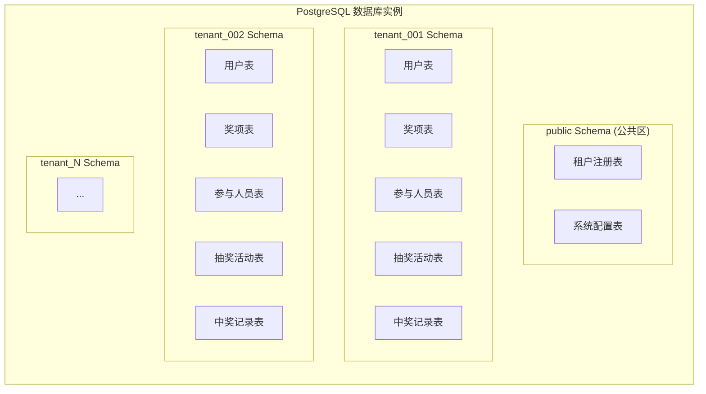

### 公共 Schema (public) 表结构

#### 租户注册表 (tenant_registry)

| 字段名 | 类型 | 约束 | 说明 |
|--------|------|------|------|
| tenant_id | UUID | PK | 租户唯一标识 |
| tenant_code | VARCHAR(50) | UNIQUE, NOT NULL | 租户代码(子域名) |
| tenant_name | VARCHAR(100) | NOT NULL | 租户名称 |
| schema_name | VARCHAR(63) | UNIQUE, NOT NULL | Schema 名称 |
| admin_user_id | UUID | NOT NULL | 管理员用户 ID |
| status | VARCHAR(20) | NOT NULL | 状态(ACTIVE/SUSPENDED) |
| subscription_plan | VARCHAR(50) | | 订阅计划 |
| max_users | INTEGER | DEFAULT 10 | 最大用户数限制 |
| max_activities | INTEGER | DEFAULT 100 | 最大活动数限制 |
| storage_quota_mb | INTEGER | DEFAULT 1024 | 存储配额(MB) |
| created_at | TIMESTAMP | NOT NULL | 创建时间 |
| updated_at | TIMESTAMP | NOT NULL | 更新时间 |
| expired_at | TIMESTAMP | | 过期时间 |

#### 系统配置表 (system_config)

| 字段名 | 类型 | 约束 | 说明 |
|--------|------|------|------|
| config_id | UUID | PK | 配置 ID |
| config_key | VARCHAR(100) | UNIQUE, NOT NULL | 配置键 |
| config_value | TEXT | | 配置值 |
| config_type | VARCHAR(20) | | 配置类型(STRING/JSON/NUMBER) |
| description | VARCHAR(500) | | 配置描述 |
| is_public | BOOLEAN | DEFAULT false | 是否公开 |
| created_at | TIMESTAMP | NOT NULL | 创建时间 |
| updated_at | TIMESTAMP | NOT NULL | 更新时间 |

### 租户 Schema (tenant_xxx) 表结构

#### 用户表 (users)

| 字段名 | 类型 | 约束 | 说明 |
|--------|------|------|------|
| user_id | UUID | PK | 用户 ID |
| username | VARCHAR(50) | UNIQUE, NOT NULL | 用户名 |
| password_hash | VARCHAR(255) | NOT NULL | 密码哈希(BCrypt) |
| email | VARCHAR(100) | UNIQUE | 邮箱 |
| phone | VARCHAR(20) | | 手机号 |
| real_name | VARCHAR(50) | | 真实姓名 |
| role | VARCHAR(20) | NOT NULL | 角色(ADMIN/OPERATOR/VIEWER) |
| status | VARCHAR(20) | NOT NULL | 状态(ACTIVE/DISABLED) |
| last_login_at | TIMESTAMP | | 最后登录时间 |
| created_at | TIMESTAMP | NOT NULL | 创建时间 |
| updated_at | TIMESTAMP | NOT NULL | 更新时间 |
| created_by | UUID | | 创建人 ID |

#### 抽奖活动表 (lottery_activities)

| 字段名 | 类型 | 约束 | 说明 |
|--------|------|------|------|
| activity_id | UUID | PK | 活动 ID |
| activity_name | VARCHAR(100) | NOT NULL | 活动名称 |
| activity_type | VARCHAR(50) | | 活动类型(年会/团建/其他) |
| description | TEXT | | 活动描述 |
| status | VARCHAR(20) | NOT NULL | 状态(DRAFT/ACTIVE/COMPLETED/ARCHIVED) |
| start_time | TIMESTAMP | | 活动开始时间 |
| end_time | TIMESTAMP | | 活动结束时间 |
| total_participants | INTEGER | DEFAULT 0 | 参与总人数 |
| total_winners | INTEGER | DEFAULT 0 | 中奖总人数 |
| config_json | JSONB | | 活动配置(JSON格式) |
| created_at | TIMESTAMP | NOT NULL | 创建时间 |
| updated_at | TIMESTAMP | NOT NULL | 更新时间 |
| created_by | UUID | NOT NULL | 创建人 ID |

**config_json 字段结构示例**：
```json
{
  "theme": "春节主题",
  "animation": {
    "enableFireworks": true,
    "enableCoins": true,
    "rollingSpeed": 50
  },
  "rules": {
    "allowMultipleWins": false,
    "drawOrder": "LOW_TO_HIGH"
  }
}
```

#### 奖项表 (prizes)

| 字段名 | 类型 | 约束 | 说明 |
|--------|------|------|------|
| prize_id | UUID | PK | 奖项 ID |
| activity_id | UUID | FK, NOT NULL | 所属活动 ID |
| prize_name | VARCHAR(100) | NOT NULL | 奖项名称(特等奖/一等奖等) |
| prize_level | INTEGER | NOT NULL | 奖项等级(数字越小等级越高) |
| gift_name | VARCHAR(200) | | 奖品名称 |
| gift_image_url | VARCHAR(500) | | 奖品图片 URL |
| total_quota | INTEGER | NOT NULL | 总名额 |
| drawn_count | INTEGER | DEFAULT 0 | 已抽取数量 |
| draw_order | INTEGER | NOT NULL | 抽奖顺序 |
| status | VARCHAR(20) | NOT NULL | 状态(PENDING/DRAWING/COMPLETED) |
| created_at | TIMESTAMP | NOT NULL | 创建时间 |
| updated_at | TIMESTAMP | NOT NULL | 更新时间 |

**索引**：
- `idx_activity_id`: activity_id
- `idx_draw_order`: (activity_id, draw_order)

#### 参与人员表 (participants)

| 字段名 | 类型 | 约束 | 说明 |
|--------|------|------|------|
| participant_id | UUID | PK | 参与人员 ID |
| activity_id | UUID | FK, NOT NULL | 所属活动 ID |
| name | VARCHAR(100) | NOT NULL | 姓名 |
| employee_no | VARCHAR(50) | | 工号 |
| department | VARCHAR(100) | | 部门 |
| phone | VARCHAR(20) | | 联系电话 |
| email | VARCHAR(100) | | 邮箱 |
| extra_info | JSONB | | 扩展信息 |
| is_winner | BOOLEAN | DEFAULT false | 是否已中奖 |
| import_batch | VARCHAR(50) | | 导入批次号 |
| created_at | TIMESTAMP | NOT NULL | 创建时间 |
| updated_at | TIMESTAMP | NOT NULL | 更新时间 |

**索引**：
- `idx_activity_id`: activity_id
- `idx_is_winner`: (activity_id, is_winner)
- `unique_participant`: (activity_id, name, employee_no) - 唯一约束

#### 中奖记录表 (winner_records)

| 字段名 | 类型 | 约束 | 说明 |
|--------|------|------|------|
| record_id | UUID | PK | 记录 ID |
| activity_id | UUID | FK, NOT NULL | 所属活动 ID |
| prize_id | UUID | FK, NOT NULL | 奖项 ID |
| participant_id | UUID | FK, NOT NULL | 中奖人员 ID |
| participant_name | VARCHAR(100) | NOT NULL | 中奖人姓名(冗余) |
| prize_name | VARCHAR(100) | NOT NULL | 奖项名称(冗余) |
| gift_name | VARCHAR(200) | | 奖品名称(冗余) |
| draw_time | TIMESTAMP | NOT NULL | 抽奖时间 |
| draw_sequence | INTEGER | NOT NULL | 抽奖序号(第几个抽出) |
| operator_id | UUID | | 操作员 ID |
| operator_name | VARCHAR(50) | | 操作员姓名 |
| remarks | TEXT | | 备注 |
| created_at | TIMESTAMP | NOT NULL | 创建时间 |

**索引**：
- `idx_activity_id`: activity_id
- `idx_prize_id`: prize_id
- `idx_draw_time`: (activity_id, draw_time)
- `unique_winner`: (activity_id, participant_id) - 保证一人只中一次

#### 操作日志表 (operation_logs)

| 字段名 | 类型 | 约束 | 说明 |
|--------|------|------|------|
| log_id | UUID | PK | 日志 ID |
| activity_id | UUID | FK | 关联活动 ID |
| operator_id | UUID | NOT NULL | 操作人 ID |
| operator_name | VARCHAR(50) | | 操作人姓名 |
| operation_type | VARCHAR(50) | NOT NULL | 操作类型 |
| operation_desc | VARCHAR(500) | | 操作描述 |
| target_type | VARCHAR(50) | | 目标类型(ACTIVITY/PRIZE/PARTICIPANT) |
| target_id | UUID | | 目标 ID |
| request_params | JSONB | | 请求参数 |
| ip_address | VARCHAR(50) | | IP 地址 |
| user_agent | VARCHAR(500) | | User Agent |
| created_at | TIMESTAMP | NOT NULL | 创建时间 |

**索引**：
- `idx_activity_id`: activity_id
- `idx_operator_id`: operator_id
- `idx_created_at`: created_at

### 数据库初始化流程

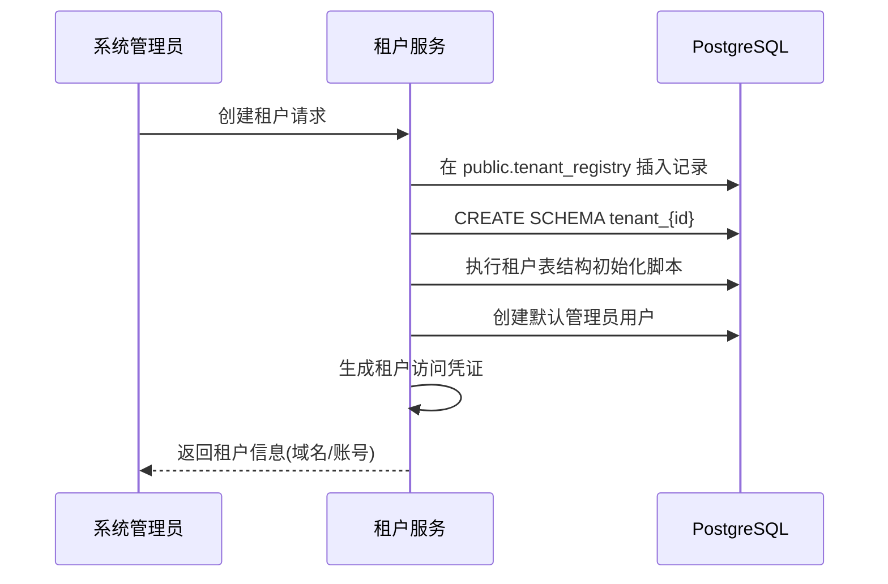

## 权限管理设计

### 角色定义

| 角色代码 | 角色名称 | 权限范围 |
|---------|---------|---------|
| ADMIN | 管理员 | 租户内所有权限：用户管理、活动管理、数据查询、系统配置 |
| OPERATOR | 操作员 | 活动创建、抽奖执行、数据导入、结果查询 |
| VIEWER | 查看者 | 只读权限：查看活动信息、中奖记录 |

### 权限矩阵

| 功能模块 | 操作 | ADMIN | OPERATOR | VIEWER |
|---------|------|-------|----------|--------|
| 用户管理 | 新增用户 | ✓ | ✗ | ✗ |
| 用户管理 | 修改用户 | ✓ | ✗ | ✗ |
| 用户管理 | 删除用户 | ✓ | ✗ | ✗ |
| 用户管理 | 查看用户列表 | ✓ | ✗ | ✗ |
| 活动管理 | 创建活动 | ✓ | ✓ | ✗ |
| 活动管理 | 修改活动 | ✓ | ✓ | ✗ |
| 活动管理 | 删除活动 | ✓ | ✗ | ✗ |
| 活动管理 | 查看活动 | ✓ | ✓ | ✓ |
| 奖项管理 | 添加奖项 | ✓ | ✓ | ✗ |
| 奖项管理 | 修改奖项 | ✓ | ✓ | ✗ |
| 奖项管理 | 删除奖项 | ✓ | ✓ | ✗ |
| 奖项管理 | 查看奖项 | ✓ | ✓ | ✓ |
| 人员管理 | 导入人员 | ✓ | ✓ | ✗ |
| 人员管理 | 添加人员 | ✓ | ✓ | ✗ |
| 人员管理 | 修改人员 | ✓ | ✓ | ✗ |
| 人员管理 | 删除人员 | ✓ | ✓ | ✗ |
| 人员管理 | 查看人员 | ✓ | ✓ | ✓ |
| 抽奖执行 | 开始抽奖 | ✓ | ✓ | ✗ |
| 抽奖执行 | 停止抽奖 | ✓ | ✓ | ✗ |
| 抽奖执行 | 保存中奖记录 | ✓ | ✓ | ✗ |
| 抽奖执行 | 重置抽奖 | ✓ | ✗ | ✗ |
| 数据查询 | 查询历史活动 | ✓ | ✓ | ✓ |
| 数据查询 | 查询中奖记录 | ✓ | ✓ | ✓ |
| 数据查询 | 导出数据 | ✓ | ✓ | ✗ |
| 系统配置 | 修改租户配置 | ✓ | ✗ | ✗ |

### 认证授权流程

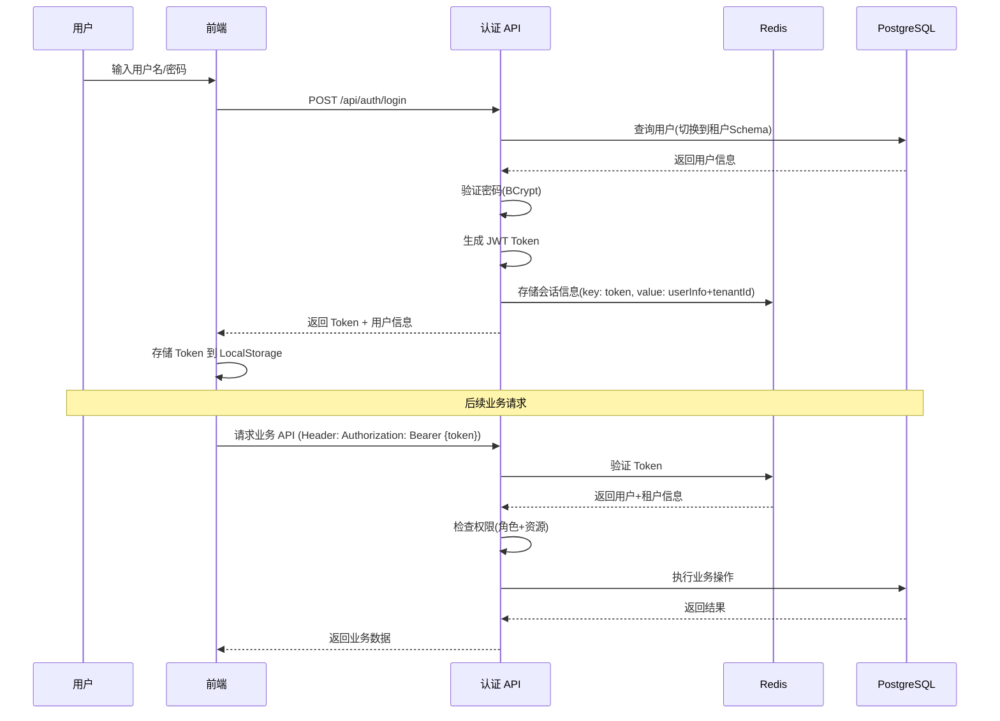

**JWT Token 结构**：
```json
{
  "sub": "user-uuid",
  "tenantId": "tenant-uuid",
  "username": "admin",
  "role": "ADMIN",
  "iat": 1702800000,
  "exp": 1702886400
}
```

## 核心业务流程设计

### 用户注册与租户创建流程

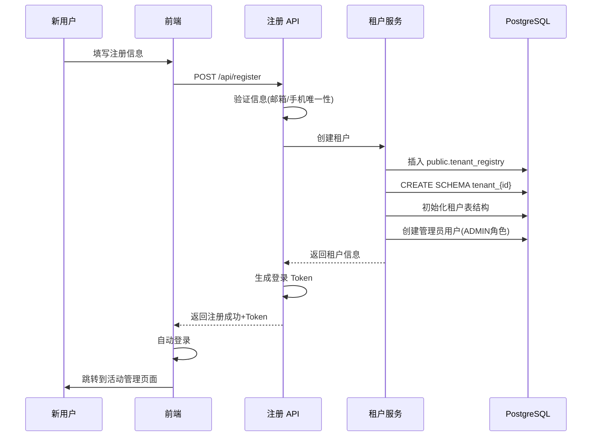

### 抽奖活动创建流程

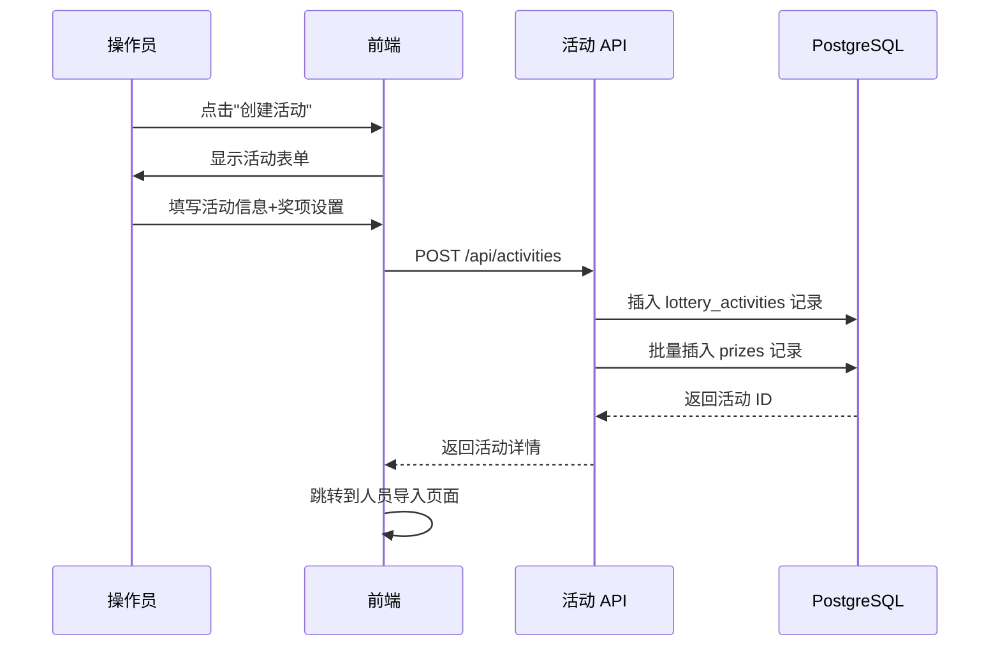

### 参与人员导入流程

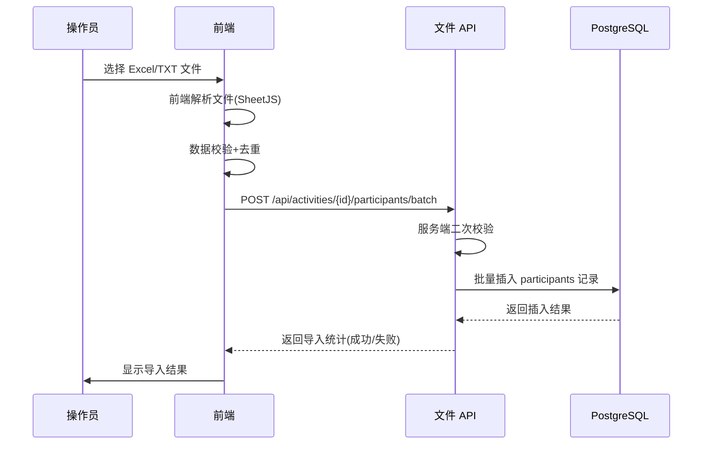

**导入数据格式**：
```json
{
  "activityId": "uuid",
  "importBatch": "batch-20240101-001",
  "participants": [
    {
      "name": "张三",
      "employeeNo": "EMP001",
      "department": "技术部",
      "phone": "13800138000",
      "email": "zhangsan@example.com"
    }
  ]
}
```

### 抽奖执行流程（核心）

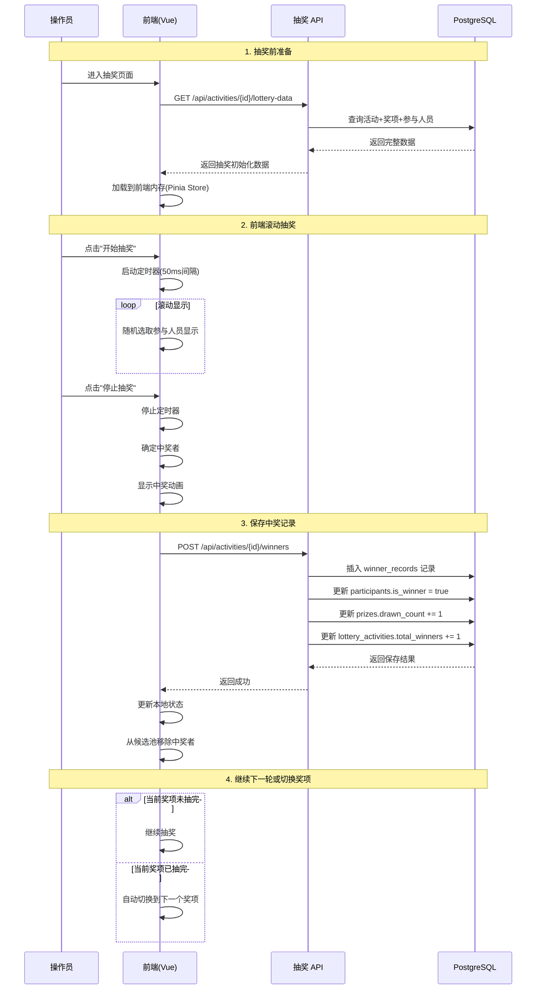

**保存中奖记录请求体**：
```json
{
  "activityId": "uuid",
  "prizeId": "uuid",
  "participantId": "uuid",
  "drawTime": "2024-01-01T15:30:00Z",
  "drawSequence": 1
}
```

### 历史数据查询流程

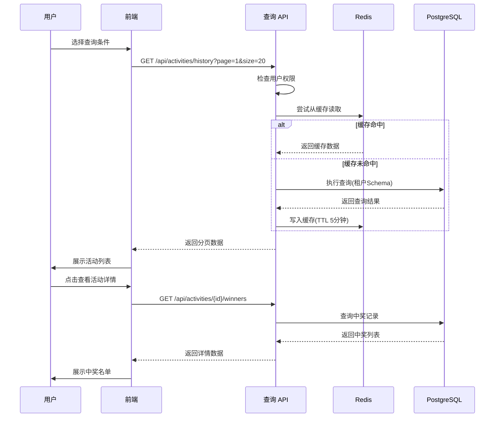

## 前端架构设计

### 应用结构

```
lottery-frontend/
├── src/
│   ├── main.js                 # 应用入口
│   ├── App.vue                 # 根组件
│   ├── router/                 # 路由配置
│   │   └── index.js
│   ├── stores/                 # Pinia 状态管理
│   │   ├── user.js            # 用户状态
│   │   ├── tenant.js          # 租户状态
│   │   ├── lottery.js         # 抽奖状态(核心)
│   │   └── activity.js        # 活动状态
│   ├── api/                    # API 请求封装
│   │   ├── auth.js
│   │   ├── activity.js
│   │   ├── lottery.js
│   │   └── query.js
│   ├── views/                  # 页面组件
│   │   ├── Login.vue          # 登录页
│   │   ├── Register.vue       # 注册页
│   │   ├── Dashboard.vue      # 仪表盘
│   │   ├── ActivityList.vue   # 活动列表
│   │   ├── ActivityCreate.vue # 创建活动
│   │   ├── LotteryDraw.vue    # 抽奖页面(核心)
│   │   ├── HistoryQuery.vue   # 历史查询
│   │   └── UserManage.vue     # 用户管理(仅ADMIN)
│   ├── components/             # 公共组件
│   │   ├── layout/
│   │   │   ├── Header.vue
│   │   │   ├── Sidebar.vue
│   │   │   └── Footer.vue
│   │   ├── lottery/           # 抽奖相关组件
│   │   │   ├── PrizeDisplay.vue      # 奖项展示
│   │   │   ├── RollingDisplay.vue    # 滚动显示区
│   │   │   ├── ControlPanel.vue      # 控制面板
│   │   │   ├── WinnerList.vue        # 中奖名单
│   │   │   ├── ParticipantGrid.vue   # 参与人员网格
│   │   │   └── Fireworks.vue         # 烟花动画
│   │   └── common/
│   │       ├── FileUpload.vue        # 文件上传
│   │       └── DataTable.vue         # 数据表格
│   ├── utils/                  # 工具函数
│   │   ├── request.js         # Axios 封装
│   │   ├── auth.js            # 认证工具
│   │   ├── tenant.js          # 租户识别
│   │   └── file-parser.js     # 文件解析(Excel/TXT)
│   ├── assets/                 # 静态资源
│   │   ├── styles/
│   │   │   ├── variables.scss
│   │   │   └── lottery.scss   # 抽奖页面样式(复用原有样式)
│   │   └── images/
│   └── config/                 # 配置文件
│       └── constants.js
├── public/
│   └── index.html
├── package.json
└── vite.config.js
```

### 核心页面设计

#### 抽奖页面 (LotteryDraw.vue) 布局

延续原有四栏布局设计，保持用户体验一致性：

```
┌─────────────────────────────────────────────────────────────┐
│  顶部导航栏：活动标题 | 返回按钮 | 用户信息                   │
├──────────┬────────────────┬─────────────────┬───────────────┤
│          │                │                 │               │
│ 左侧边栏 │   中左设置区   │  中右抽奖主区   │ 右侧中奖名单  │
│          │                │                 │               │
│ 参会人员 │  奖项设置面板  │  当前奖项信息   │  按奖项分组   │
│ 网格显示 │                │                 │  显示中奖者   │
│          │  人员导入按钮  │  滚动显示区域   │               │
│ 统计信息 │                │                 │  实时更新     │
│ - 总人数 │  统计信息      │  控制按钮：     │               │
│ - 已中奖 │  - 总人数      │  - 开始/停止    │               │
│ - 未中奖 │  - 剩余人数    │  - 保存记录     │               │
│          │                │  - 重置抽奖     │               │
│          │                │                 │               │
└──────────┴────────────────┴─────────────────┴───────────────┘
```

### 状态管理设计（lottery.js Store）

**核心状态**：
```javascript
{
  // 活动数据
  currentActivity: null,
  
  // 奖项列表（从数据库加载）
  prizes: [],
  currentPrizeIndex: 0,
  
  // 参与人员（从数据库加载）
  allParticipants: [],
  remainingParticipants: [],
  
  // 中奖记录（从数据库加载+本地新增）
  winners: {},
  
  // 抽奖控制
  isRolling: false,
  currentRollingName: '',
  rollingInterval: null,
  
  // 同步状态
  isSyncing: false,
  lastSyncTime: null
}
```

**核心方法**：
- `loadLotteryData(activityId)`: 从后端加载完整抽奖数据
- `startRolling()`: 启动前端滚动动画
- `stopRolling()`: 停止滚动并确定中奖者
- `saveWinner(winnerData)`: 保存中奖记录到后端
- `resetLottery()`: 重置抽奖状态（需后端确认）
- `switchToNextPrize()`: 切换到下一个奖项

### 租户识别实现

**Axios 请求拦截器**：
```javascript
// 从当前 URL 提取租户标识
const getTenantId = () => {
  const hostname = window.location.hostname;
  const parts = hostname.split('.');
  
  // 子域名模式：tenant1.lottery.com
  if (parts.length > 2) {
    return parts[0];
  }
  
  // 从 LocalStorage 读取
  return localStorage.getItem('tenantId');
};

// 请求拦截器
axios.interceptors.request.use(config => {
  const token = localStorage.getItem('token');
  const tenantId = getTenantId();
  
  if (token) {
    config.headers['Authorization'] = `Bearer ${token}`;
  }
  
  if (tenantId) {
    config.headers['X-Tenant-Id'] = tenantId;
  }
  
  return config;
});
```

## 后端架构设计

### 应用分层结构

```
lottery-backend/
├── src/main/java/com/lottery/
│   ├── LotteryApplication.java         # 启动类
│   ├── config/                         # 配置类
│   │   ├── SecurityConfig.java        # Spring Security 配置
│   │   ├── DataSourceConfig.java      # 多数据源配置
│   │   ├── RedisConfig.java           # Redis 配置
│   │   ├── MyBatisConfig.java         # MyBatis 配置
│   │   └── WebMvcConfig.java          # Web MVC 配置
│   ├── common/                         # 公共模块
│   │   ├── constant/                  # 常量定义
│   │   │   ├── RoleConstant.java
│   │   │   └── StatusConstant.java
│   │   ├── context/                   # 上下文管理
│   │   │   └── TenantContext.java     # 租户上下文(ThreadLocal)
│   │   ├── exception/                 # 异常定义
│   │   │   ├── BizException.java
│   │   │   └── GlobalExceptionHandler.java
│   │   ├── response/                  # 统一响应
│   │   │   └── Result.java
│   │   └── util/                      # 工具类
│   │       ├── JwtUtil.java
│   │       └── BcryptUtil.java
│   ├── interceptor/                    # 拦截器
│   │   ├── TenantInterceptor.java     # 租户识别拦截器
│   │   └── AuthInterceptor.java       # 认证拦截器
│   ├── aspect/                         # AOP 切面
│   │   ├── LogAspect.java             # 操作日志切面
│   │   └── PermissionAspect.java      # 权限检查切面
│   ├── filter/                         # 过滤器
│   │   └── CorsFilter.java            # 跨域过滤器
│   ├── mybatis/                        # MyBatis 扩展
│   │   └── SchemaInterceptor.java     # Schema 切换拦截器
│   ├── entity/                         # 实体类
│   │   ├── po/                        # 持久化对象
│   │   │   ├── Tenant.java
│   │   │   ├── User.java
│   │   │   ├── LotteryActivity.java
│   │   │   ├── Prize.java
│   │   │   ├── Participant.java
│   │   │   ├── WinnerRecord.java
│   │   │   └── OperationLog.java
│   │   ├── dto/                       # 数据传输对象
│   │   │   ├── LoginDTO.java
│   │   │   ├── ActivityCreateDTO.java
│   │   │   ├── ParticipantImportDTO.java
│   │   │   └── WinnerSaveDTO.java
│   │   └── vo/                        # 视图对象
│   │       ├── UserVO.java
│   │       ├── ActivityVO.java
│   │       ├── LotteryDataVO.java
│   │       └── WinnerVO.java
│   ├── mapper/                         # MyBatis Mapper
│   │   ├── TenantMapper.java
│   │   ├── UserMapper.java
│   │   ├── ActivityMapper.java
│   │   ├── PrizeMapper.java
│   │   ├── ParticipantMapper.java
│   │   ├── WinnerRecordMapper.java
│   │   └── OperationLogMapper.java
│   ├── service/                        # 业务逻辑层
│   │   ├── ITenantService.java
│   │   ├── IAuthService.java
│   │   ├── IUserService.java
│   │   ├── IActivityService.java
│   │   ├── ILotteryService.java       # 抽奖核心服务
│   │   ├── IQueryService.java
│   │   └── impl/                      # 实现类
│   │       ├── TenantServiceImpl.java
│   │       ├── AuthServiceImpl.java
│   │       ├── UserServiceImpl.java
│   │       ├── ActivityServiceImpl.java
│   │       ├── LotteryServiceImpl.java
│   │       └── QueryServiceImpl.java
│   └── controller/                     # 控制器层
│       ├── AuthController.java        # 认证接口
│       ├── TenantController.java      # 租户管理
│       ├── UserController.java        # 用户管理
│       ├── ActivityController.java    # 活动管理
│       ├── LotteryController.java     # 抽奖接口
│       └── QueryController.java       # 查询接口
├── src/main/resources/
│   ├── application.yml                # 主配置文件
│   ├── application-dev.yml            # 开发环境配置
│   ├── application-prod.yml           # 生产环境配置
│   ├── mapper/                        # MyBatis XML
│   │   ├── TenantMapper.xml
│   │   ├── UserMapper.xml
│   │   ├── ActivityMapper.xml
│   │   ├── PrizeMapper.xml
│   │   ├── ParticipantMapper.xml
│   │   ├── WinnerRecordMapper.xml
│   │   └── OperationLogMapper.xml
│   └── db/                            # 数据库脚本
│       ├── schema/
│       │   ├── init_public_schema.sql      # public Schema 初始化
│       │   └── init_tenant_schema_template.sql  # 租户 Schema 模板
│       └── data/
│           └── init_system_config.sql      # 系统配置初始数据
└── pom.xml
```

### 核心组件设计

#### Schema 动态切换拦截器

**实现逻辑**：
- 拦截所有 MyBatis SQL 执行
- 从 `TenantContext` 获取当前租户 ID
- 在 SQL 执行前设置 `search_path`
- 使用连接池隔离避免污染

**关键代码结构**：
```java
@Intercepts({
    @Signature(
        type = Executor.class,
        method = "update",
        args = {MappedStatement.class, Object.class}
    ),
    @Signature(
        type = Executor.class,
        method = "query",
        args = {MappedStatement.class, Object.class, 
                RowBounds.class, ResultHandler.class}
    )
})
public class SchemaInterceptor implements Interceptor {
    
    // 拦截 SQL 执行
    // 1. 从 TenantContext 获取 tenantId
    // 2. 查询 public.tenant_registry 获取 schema_name
    // 3. 执行: SET search_path TO {schema_name}, public
    // 4. 执行业务 SQL
    // 5. 执行完毕后重置 search_path
}
```

#### 租户上下文管理

**TenantContext 设计**：
```java
public class TenantContext {
    private static final ThreadLocal<String> TENANT_ID = 
        new InheritableThreadLocal<>();
    
    public static void setTenantId(String tenantId) {
        TENANT_ID.set(tenantId);
    }
    
    public static String getTenantId() {
        return TENANT_ID.get();
    }
    
    public static void clear() {
        TENANT_ID.remove();
    }
}
```

**租户拦截器**：
```java
public class TenantInterceptor implements HandlerInterceptor {
    
    @Override
    public boolean preHandle(HttpServletRequest request, 
                            HttpServletResponse response, 
                            Object handler) {
        // 优先级1: 从子域名提取
        String tenantId = extractFromSubdomain(request);
        
        // 优先级2: 从 Header 提取
        if (tenantId == null) {
            tenantId = request.getHeader("X-Tenant-Id");
        }
        
        // 优先级3: 从 JWT Token 提取
        if (tenantId == null) {
            tenantId = extractFromToken(request);
        }
        
        // 设置到上下文
        TenantContext.setTenantId(tenantId);
        return true;
    }
    
    @Override
    public void afterCompletion(HttpServletRequest request, 
                               HttpServletResponse response, 
                               Object handler, 
                               Exception ex) {
        // 清理上下文
        TenantContext.clear();
    }
}
```

### RESTful API 设计

#### 认证接口

| 方法 | 路径 | 说明 | 权限 |
|------|------|------|------|
| POST | /api/auth/register | 用户注册（创建租户） | 公开 |
| POST | /api/auth/login | 用户登录 | 公开 |
| POST | /api/auth/logout | 用户登出 | 认证 |
| GET | /api/auth/current | 获取当前用户信息 | 认证 |
| POST | /api/auth/refresh | 刷新 Token | 认证 |

#### 活动管理接口

| 方法 | 路径 | 说明 | 权限 |
|------|------|------|------|
| GET | /api/activities | 查询活动列表（分页） | VIEWER+ |
| GET | /api/activities/{id} | 获取活动详情 | VIEWER+ |
| POST | /api/activities | 创建活动 | OPERATOR+ |
| PUT | /api/activities/{id} | 更新活动 | OPERATOR+ |
| DELETE | /api/activities/{id} | 删除活动 | ADMIN |
| GET | /api/activities/{id}/statistics | 获取活动统计 | VIEWER+ |

#### 奖项管理接口

| 方法 | 路径 | 说明 | 权限 |
|------|------|------|------|
| GET | /api/activities/{activityId}/prizes | 获取奖项列表 | VIEWER+ |
| POST | /api/activities/{activityId}/prizes | 添加奖项 | OPERATOR+ |
| PUT | /api/prizes/{id} | 更新奖项 | OPERATOR+ |
| DELETE | /api/prizes/{id} | 删除奖项 | OPERATOR+ |

#### 参与人员接口

| 方法 | 路径 | 说明 | 权限 |
|------|------|------|------|
| GET | /api/activities/{activityId}/participants | 获取参与人员列表 | VIEWER+ |
| POST | /api/activities/{activityId}/participants | 添加单个参与人员 | OPERATOR+ |
| POST | /api/activities/{activityId}/participants/batch | 批量导入参与人员 | OPERATOR+ |
| PUT | /api/participants/{id} | 更新参与人员 | OPERATOR+ |
| DELETE | /api/participants/{id} | 删除参与人员 | OPERATOR+ |

#### 抽奖核心接口

| 方法 | 路径 | 说明 | 权限 |
|------|------|------|------|
| GET | /api/activities/{activityId}/lottery-data | 获取抽奖初始化数据 | OPERATOR+ |
| POST | /api/activities/{activityId}/winners | 保存中奖记录 | OPERATOR+ |
| POST | /api/activities/{activityId}/reset | 重置抽奖（清空中奖记录） | ADMIN |
| GET | /api/activities/{activityId}/winners | 查询中奖记录列表 | VIEWER+ |
| GET | /api/winners/{id} | 获取中奖记录详情 | VIEWER+ |

**抽奖初始化数据响应示例**：
```json
{
  "code": 200,
  "message": "success",
  "data": {
    "activity": {
      "activityId": "uuid",
      "activityName": "2024年会抽奖",
      "status": "ACTIVE",
      "totalParticipants": 100,
      "totalWinners": 0
    },
    "prizes": [
      {
        "prizeId": "uuid",
        "prizeName": "三等奖",
        "prizeLevel": 3,
        "giftName": "精美保温杯",
        "totalQuota": 10,
        "drawnCount": 0,
        "drawOrder": 1,
        "status": "PENDING"
      }
    ],
    "participants": [
      {
        "participantId": "uuid",
        "name": "张三",
        "employeeNo": "EMP001",
        "department": "技术部",
        "isWinner": false
      }
    ],
    "winners": {}
  }
}
```

#### 用户管理接口（仅 ADMIN）

| 方法 | 路径 | 说明 | 权限 |
|------|------|------|------|
| GET | /api/users | 查询用户列表 | ADMIN |
| POST | /api/users | 创建用户 | ADMIN |
| PUT | /api/users/{id} | 更新用户 | ADMIN |
| DELETE | /api/users/{id} | 删除用户 | ADMIN |
| PUT | /api/users/{id}/status | 启用/禁用用户 | ADMIN |

#### 历史查询接口

| 方法 | 路径 | 说明 | 权限 |
|------|------|------|------|
| GET | /api/history/activities | 查询历史活动（分页+筛选） | VIEWER+ |
| GET | /api/history/winners | 查询历史中奖记录（分页+筛选） | VIEWER+ |
| GET | /api/history/export | 导出历史数据（Excel） | OPERATOR+ |
| GET | /api/logs/operations | 查询操作日志 | ADMIN |

## Redis 缓存设计

### 缓存策略

| 缓存 Key 模式 | 数据内容 | TTL | 用途 |
|--------------|---------|-----|------|
| `session:{token}` | 用户会话信息（userId+tenantId+role） | 2小时 | JWT Token 验证 |
| `tenant:{tenantId}` | 租户基本信息 | 1天 | 租户信息缓存 |
| `activity:{activityId}` | 活动详情（含奖项） | 30分钟 | 活动信息缓存 |
| `participants:{activityId}` | 参与人员列表 | 30分钟 | 人员信息缓存 |
| `winners:{activityId}` | 中奖记录列表 | 10分钟 | 中奖记录缓存 |
| `user:{userId}` | 用户信息 | 1小时 | 用户信息缓存 |
| `lottery:lock:{activityId}` | 抽奖锁 | 10秒 | 防止并发抽奖 |

### 缓存更新策略

**写入策略**：
- 用户登录：写入 session 缓存
- 创建/更新活动：删除 `activity:{activityId}` 缓存
- 导入人员：删除 `participants:{activityId}` 缓存
- 保存中奖记录：删除 `winners:{activityId}` 和 `participants:{activityId}` 缓存

**读取策略**（Cache-Aside）：
1. 查询缓存
2. 缓存命中：直接返回
3. 缓存未命中：查询数据库
4. 写入缓存（设置 TTL）
5. 返回数据

### 分布式锁应用

**抽奖防并发**：
使用 Redis 分布式锁，确保同一活动同一时刻只能有一个抽奖操作：

```
Key: lottery:lock:{activityId}
Value: {operatorId}:{timestamp}
TTL: 10秒（自动过期释放）
```

**加锁逻辑**：
- 尝试 `SET lottery:lock:{activityId} {value} NX EX 10`
- 成功：获得锁，执行抽奖
- 失败：提示"抽奖进行中，请稍后"

## 部署架构设计

### 环境规划

| 环境 | 用途 | 配置建议 |
|------|------|---------|
| 开发环境 | 本地开发调试 | 单机部署，最小配置 |
| 测试环境 | 功能测试、集成测试 | 单机或小规模集群 |
| 生产环境 | 正式 SaaS 服务 | 高可用集群部署 |

### 生产环境部署架构

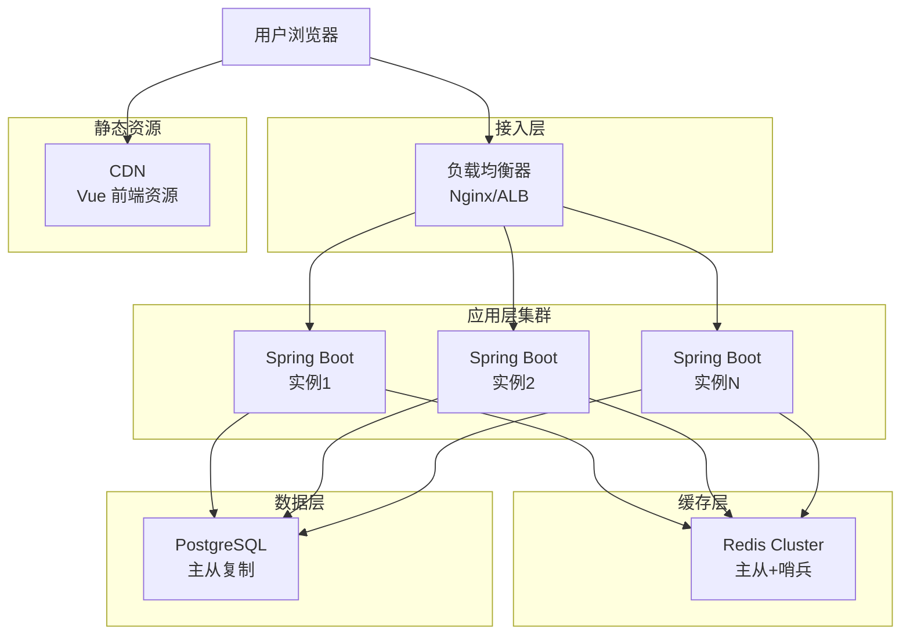

### 容器化部署方案

**Docker Compose 配置结构**：
```yaml
version: '3.8'

services:
  # PostgreSQL 数据库
  postgres:
    image: postgres:15-alpine
    环境变量:
      - POSTGRES_DB: lottery_db
      - POSTGRES_USER: lottery_user
      - POSTGRES_PASSWORD: {password}
    持久化卷:
      - postgres_data:/var/lib/postgresql/data
    端口: 5432
    
  # Redis 缓存
  redis:
    image: redis:7-alpine
    持久化卷:
      - redis_data:/data
    端口: 6379
    
  # Spring Boot 后端
  backend:
    构建: ./lottery-backend
    环境变量:
      - SPRING_PROFILES_ACTIVE: prod
      - DB_HOST: postgres
      - REDIS_HOST: redis
    依赖:
      - postgres
      - redis
    端口: 8080
    
  # Nginx 反向代理 + 前端资源
  nginx:
    image: nginx:alpine
    配置卷:
      - ./nginx.conf:/etc/nginx/nginx.conf
      - ./lottery-frontend/dist:/usr/share/nginx/html
    依赖:
      - backend
    端口: 80, 443
```

### 配置管理

**application.yml 核心配置项**：

```yaml
spring:
  datasource:
    url: jdbc:postgresql://${DB_HOST}:${DB_PORT}/${DB_NAME}
    username: ${DB_USER}
    password: ${DB_PASSWORD}
    hikari:
      maximum-pool-size: 20
      minimum-idle: 5
      connection-timeout: 30000
      
  redis:
    host: ${REDIS_HOST}
    port: ${REDIS_PORT}
    password: ${REDIS_PASSWORD}
    lettuce:
      pool:
        max-active: 8
        max-idle: 8
        min-idle: 2
        
jwt:
  secret: ${JWT_SECRET}
  expiration: 7200  # 2小时
  
tenant:
  schema-prefix: tenant_
  default-schema: public
  
file:
  upload:
    max-size: 10MB
    allowed-types: xlsx,xls,txt
```

## 安全设计

### 数据安全

**密码存储**：
- 使用 BCrypt 算法加密存储
- 加盐强度：10 轮

**敏感数据脱敏**：
- 手机号：中间4位脱敏（138****1234）
- 邮箱：部分脱敏（abc***@example.com）
- 身份证：保留前6后4位

**SQL 注入防护**：
- MyBatis 参数化查询（#{} 而非 ${}）
- 输入验证和过滤

### 接口安全

**HTTPS 传输**：
- 生产环境强制 HTTPS
- TLS 1.2+

**CORS 跨域配置**：
- 限制允许的域名列表
- 仅允许必要的 HTTP 方法

**限流策略**：
- 登录接口：单 IP 每分钟最多 10 次
- 业务接口：单用户每秒最多 100 次
- 使用 Redis + Lua 脚本实现

**防重放攻击**：
- JWT Token 有效期限制
- 敏感操作增加时间戳验证

### 租户隔离安全

**Schema 隔离**：
- 每个租户独立 Schema
- 数据库层面物理隔离

**权限校验**：
- 每个请求验证租户 ID
- 禁止跨租户数据访问

**审计日志**：
- 记录所有数据修改操作
- 日志包含：操作人、时间、IP、操作内容

## 性能优化

### 数据库优化

**索引策略**：
- 主键：自动创建聚簇索引
- 外键：创建普通索引
- 查询频繁字段：创建复合索引
- 定期分析索引使用情况，清理无效索引

**查询优化**：
- 分页查询：使用 LIMIT + OFFSET
- 大数据量导出：使用游标（Cursor）
- 避免 SELECT *，按需查询字段

**连接池配置**：
- 最大连接数：20（根据并发量调整）
- 最小空闲连接：5
- 连接超时：30秒

### 缓存优化

**缓存预热**：
- 系统启动时加载热点租户数据
- 活动开始前预加载活动数据

**缓存穿透防护**：
- 布隆过滤器拦截不存在的查询
- 空结果缓存（TTL 较短）

**缓存雪崩防护**：
- TTL 随机化（基准值 ± 10%）
- 限流降级

### 前端优化

**资源优化**：
- Vite 打包压缩
- 图片懒加载
- CDN 加速静态资源

**渲染优化**：
- 虚拟滚动（参与人员列表）
- 防抖节流（搜索输入）
- 组件懒加载（路由级别）

**网络优化**：
- API 请求合并
- 数据分页加载
- WebSocket 替代轮询（未来扩展）

## 监控与运维

### 监控指标

**应用监控**：
- JVM 堆内存使用率
- GC 频率和耗时
- 线程池状态
- 接口响应时间
- 接口错误率

**数据库监控**：
- 连接数
- 慢查询（>1秒）
- 死锁检测
- 表空间使用率

**缓存监控**：
- 命中率
- 内存使用率
- 网络 IO

**业务监控**：
- 租户注册数
- 活跃租户数
- 活动创建数
- 抽奖执行次数

### 日志管理

**日志分类**：
- 访问日志（Access Log）
- 业务日志（Business Log）
- 错误日志（Error Log）
- 审计日志（Audit Log）

**日志级别**：
- 开发环境：DEBUG
- 测试环境：INFO
- 生产环境：WARN

**日志存储**：
- 本地文件：按日期轮转（保留7天）
- 集中式日志：ELK Stack（Elasticsearch + Logstash + Kibana）

### 备份与恢复

**数据库备份**：
- 全量备份：每天凌晨2点
- 增量备份：每6小时
- 保留周期：全量30天，增量7天

**备份验证**：
- 每周随机抽取备份进行恢复测试

**灾难恢复**：
- RTO（恢复时间目标）：≤ 4小时
- RPO（恢复点目标）：≤ 6小时

## 扩展性设计

### 水平扩展

**应用层**：
- 无状态设计，支持任意扩展
- 通过负载均衡器动态添加实例

**数据库层**：
- 读写分离：主库写，从库读
- 分库分表：按租户 ID 分库（未来）

**缓存层**：
- Redis Cluster 模式
- 支持节点动态增减

### 功能扩展预留

**预留扩展点**：
- 第三方登录（OAuth2）
- 短信/邮件通知
- 数据导出（PDF/Word）
- 抽奖动画自定义
- 多语言支持（i18n）
- 移动端适配（响应式）
- 小程序版本
- 数据统计分析（BI）

## 迁移方案

### 数据迁移策略

**现有数据迁移**：
由于现有系统无持久化，新系统上线时无需迁移历史数据，用户从零开始使用。

**用户引导**：
- 提供详细的使用文档
- 提供视频教程
- 提供在线客服支持

### 上线步骤

1. **环境准备**（1天）
   - 部署数据库和 Redis
   - 初始化 public Schema
   - 配置域名和 SSL 证书

2. **应用部署**（1天）
   - 部署后端服务
   - 部署前端资源到 CDN
   - 配置 Nginx 反向代理

3. **测试验证**（2天）
   - 功能测试：完整业务流程
   - 性能测试：并发压力测试
   - 安全测试：渗透测试

4. **试运行**（1周）
   - 邀请小部分用户试用
   - 收集反馈并优化

5. **正式上线**
   - 开放用户注册
   - 发布官方公告

## 风险评估与应对

| 风险类型 | 风险描述 | 影响程度 | 应对措施 |
|---------|---------|---------|---------|
| 技术风险 | Schema 切换失败导致数据混乱 | 高 | 严格测试，增加事务回滚机制 |
| 性能风险 | 高并发下数据库连接池耗尽 | 中 | 连接池监控+自动扩容 |
| 安全风险 | 租户数据泄露 | 高 | 多层权限验证，安全审计 |
| 业务风险 | 抽奖结果丢失（网络中断） | 中 | 前端本地缓存+后端异步重试 |
| 运维风险 | 数据库故障导致服务不可用 | 高 | 主从复制+定期备份 |

**关键应对策略**：
- 灰度发布：逐步放量，降低风险
- 监控告警：实时监控，快速响应
- 回滚预案：保留旧版本，随时回滚
- 应急演练：定期演练故障恢复流程
