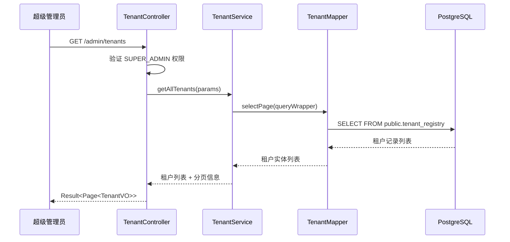
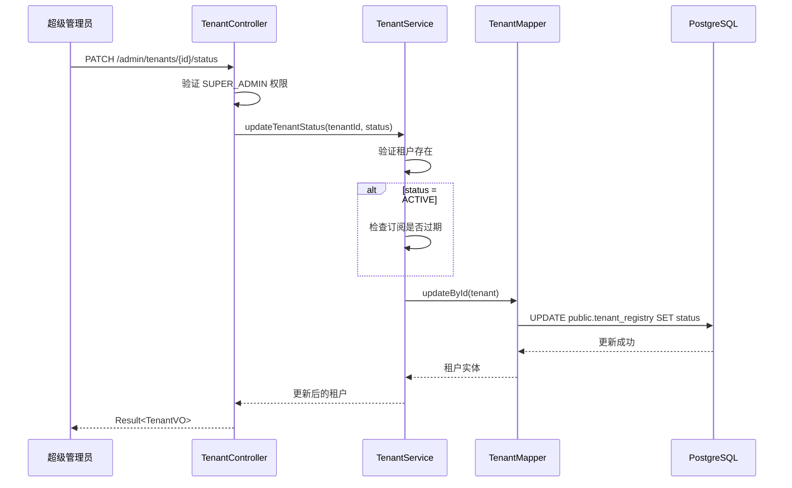
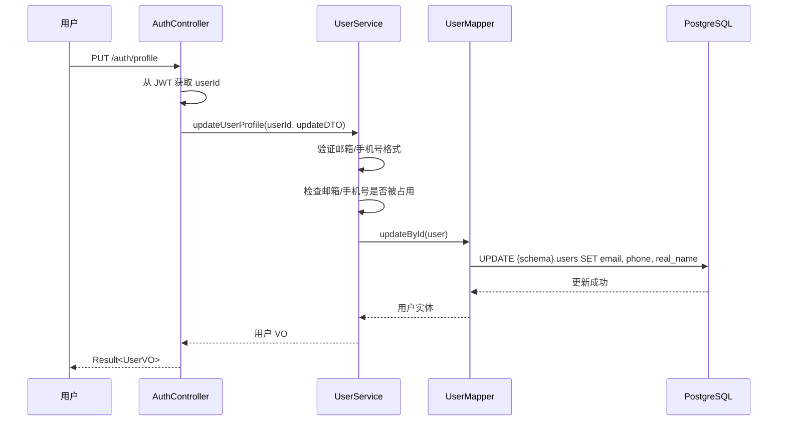

# 租户管理与用户信息修改功能设计

## 一、功能概述

本设计旨在增强系统的租户管理能力和用户自我管理能力，主要包含两个核心功能模块：

### 1.1 租户管理功能
超级管理员可以对系统中的租户进行全生命周期管理，包括：
- 查询租户列表和详情
- 修改租户基本信息和配置
- 禁用/启用租户

### 1.2 用户信息修改功能
普通用户可以修改自己的个人信息，包括：
- 修改邮箱
- 修改手机号
- 修改真实姓名

## 二、角色与权限

### 2.1 超级管理员角色定义

系统需要引入超级管理员角色，用于管理所有租户：

| 角色标识 | 角色名称 | 权限范围 | 数据范围 |
|---------|---------|---------|---------|
| SUPER_ADMIN | 超级管理员 | 租户管理、系统配置 | 跨租户访问 public schema |
| ADMIN | 租户管理员 | 租户内用户管理、活动管理 | 当前租户 schema |
| OPERATOR | 操作员 | 活动操作、抽奖执行 | 当前租户 schema |
| VIEWER | 查看者 | 只读查看 | 当前租户 schema |

### 2.2 权限控制策略

#### 租户管理权限
- 仅 SUPER_ADMIN 角色可以访问租户管理接口
- SUPER_ADMIN 不受租户上下文限制，直接操作 public.tenant_registry 表
- 租户管理接口路径统一使用 `/admin/tenants` 前缀

#### 用户信息修改权限
- 所有已认证用户都可以修改自己的信息
- 用户只能修改自己的信息，不能修改他人信息
- 敏感字段（如角色、状态）不允许用户自行修改

## 三、数据模型

### 3.1 租户实体扩展

租户实体已包含必要字段，当前设计将使用以下字段：

| 字段名 | 类型 | 说明 | 可修改 |
|-------|------|------|--------|
| tenantId | String | 租户唯一标识 | 否 |
| tenantCode | String | 租户代码（子域名） | 是 |
| tenantName | String | 租户名称 | 是 |
| schemaName | String | 数据库 Schema 名称 | 否 |
| adminUserId | String | 管理员用户 ID | 否 |
| status | String | 状态（ACTIVE/SUSPENDED） | 是 |
| subscriptionPlan | String | 订阅计划 | 是 |
| maxUsers | Integer | 最大用户数限制 | 是 |
| maxActivities | Integer | 最大活动数限制 | 是 |
| storageQuotaMb | Integer | 存储配额(MB) | 是 |
| expiredAt | LocalDateTime | 过期时间 | 是 |

### 3.2 用户信息更新模型

定义用户可以修改的字段：

| 字段名 | 类型 | 验证规则 | 说明 |
|-------|------|---------|------|
| email | String | 邮箱格式，可选 | 用户邮箱 |
| phone | String | 手机号格式，可选 | 用户手机号 |
| realName | String | 1-50字符，可选 | 真实姓名 |

**不可修改字段**（由系统或管理员控制）：
- userId、username：用户身份标识
- passwordHash：通过专门的修改密码接口处理
- role、status：权限和状态由管理员管理
- createdAt、updatedAt、lastLoginAt：系统维护时间戳

## 四、接口设计

### 4.1 租户管理接口

#### 4.1.1 查询租户列表
- **接口路径**：GET /admin/tenants
- **权限要求**：SUPER_ADMIN
- **请求参数**：
  - page（可选）：页码，默认 1
  - pageSize（可选）：每页数量，默认 20
  - status（可选）：状态过滤（ACTIVE/SUSPENDED）
  - keyword（可选）：搜索关键字（租户代码或名称）
- **响应数据**：
  - 租户列表（包含所有租户字段）
  - 分页信息（总数、当前页、总页数）

#### 4.1.2 查询租户详情
- **接口路径**：GET /admin/tenants/{tenantId}
- **权限要求**：SUPER_ADMIN
- **路径参数**：
  - tenantId：租户 ID
- **响应数据**：
  - 租户完整信息
  - 租户管理员信息（用户名、邮箱）
  - 租户使用统计（当前用户数、活动数、存储使用量）

#### 4.1.3 修改租户信息
- **接口路径**：PUT /admin/tenants/{tenantId}
- **权限要求**：SUPER_ADMIN
- **路径参数**：
  - tenantId：租户 ID
- **请求体**：
  - tenantName：租户名称（可选）
  - tenantCode：租户代码（可选）
  - subscriptionPlan：订阅计划（可选）
  - maxUsers：最大用户数（可选）
  - maxActivities：最大活动数（可选）
  - storageQuotaMb：存储配额（可选）
  - expiredAt：过期时间（可选）
- **响应数据**：
  - 更新后的租户信息
- **业务规则**：
  - 租户代码修改需要检查唯一性
  - 修改配额时需要验证当前使用量不超过新配额
  - 自动更新 updatedAt 字段

#### 4.1.4 禁用/启用租户
- **接口路径**：PATCH /admin/tenants/{tenantId}/status
- **权限要求**：SUPER_ADMIN
- **路径参数**：
  - tenantId：租户 ID
- **请求体**：
  - status：目标状态（ACTIVE/SUSPENDED）
- **响应数据**：
  - 更新后的租户状态
- **业务规则**：
  - 禁用租户后，该租户下的所有用户无法登录
  - 禁用租户后，该租户的所有活动无法执行
  - 启用租户需要检查订阅是否过期

### 4.2 用户信息修改接口

#### 4.2.1 获取当前用户信息
- **接口路径**：GET /auth/current
- **权限要求**：已认证用户
- **响应数据**：
  - 当前用户完整信息（UserVO）
- **说明**：接口已存在，无需修改

#### 4.2.2 修改用户信息
- **接口路径**：PUT /auth/profile
- **权限要求**：已认证用户
- **请求体**：
  - email：邮箱（可选）
  - phone：手机号（可选）
  - realName：真实姓名（可选）
- **响应数据**：
  - 更新后的用户信息（UserVO）
- **业务规则**：
  - 只能修改自己的信息
  - 邮箱和手机号需要格式验证
  - 至少提供一个字段进行修改
  - 自动更新 updatedAt 字段

## 五、业务流程

### 5.1 租户查询流程

### 5.2 租户禁用流程

### 5.3 用户信息修改流程

## 六、租户上下文处理

### 6.1 超级管理员访问租户表

租户管理接口访问的是 `public.tenant_registry` 表，不需要租户上下文隔离：

- TenantInterceptor 需要识别超级管理员身份，跳过租户上下文设置
- SchemaInterceptor 需要识别访问的表，如果是 public schema 的表，不进行 schema 改写

### 6.2 用户信息修改的租户隔离

用户修改自己的信息时，需要在当前租户的 schema 下操作：

- 使用 TenantInterceptor 设置当前用户的租户上下文
- SchemaInterceptor 根据租户上下文将 SQL 路由到对应 schema
- 确保用户只能修改自己租户内的数据

## 七、数据传输对象

### 7.1 租户查询请求 DTO

| 字段名 | 类型 | 必填 | 说明 |
|-------|------|------|------|
| page | Integer | 否 | 页码，默认 1 |
| pageSize | Integer | 否 | 每页数量，默认 20 |
| status | String | 否 | 状态过滤 |
| keyword | String | 否 | 搜索关键字 |

### 7.2 租户更新请求 DTO

| 字段名 | 类型 | 必填 | 验证规则 |
|-------|------|------|---------|
| tenantName | String | 否 | 1-100 字符 |
| tenantCode | String | 否 | 2-50 字符，字母数字下划线 |
| subscriptionPlan | String | 否 | 枚举值 |
| maxUsers | Integer | 否 | >= 1 |
| maxActivities | Integer | 否 | >= 1 |
| storageQuotaMb | Integer | 否 | >= 100 |
| expiredAt | LocalDateTime | 否 | 日期时间格式 |

### 7.3 租户视图对象 VO

扩展现有 TenantVO，增加统计信息：

| 字段名 | 类型 | 说明 |
|-------|------|------|
| tenantId | String | 租户 ID |
| tenantCode | String | 租户代码 |
| tenantName | String | 租户名称 |
| status | String | 状态 |
| subscriptionPlan | String | 订阅计划 |
| maxUsers | Integer | 最大用户数 |
| maxActivities | Integer | 最大活动数 |
| storageQuotaMb | Integer | 存储配额 |
| currentUsers | Integer | 当前用户数（统计） |
| currentActivities | Integer | 当前活动数（统计） |
| storageUsedMb | Integer | 已使用存储（统计） |
| adminUsername | String | 管理员用户名 |
| adminEmail | String | 管理员邮箱 |
| createdAt | LocalDateTime | 创建时间 |
| updatedAt | LocalDateTime | 更新时间 |
| expiredAt | LocalDateTime | 过期时间 |

### 7.4 用户信息更新 DTO

| 字段名 | 类型 | 必填 | 验证规则 |
|-------|------|------|---------|
| email | String | 否 | 邮箱格式 |
| phone | String | 否 | 手机号格式（11位数字） |
| realName | String | 否 | 1-50 字符 |

## 八、异常处理

### 8.1 租户管理异常

| 异常场景 | HTTP 状态码 | 错误码 | 错误信息 |
|---------|-----------|--------|---------|
| 租户不存在 | 404 | TENANT_NOT_FOUND | 租户不存在 |
| 租户代码已存在 | 400 | TENANT_CODE_EXISTS | 租户代码已被使用 |
| 配额低于使用量 | 400 | QUOTA_BELOW_USAGE | 配额不能低于当前使用量 |
| 权限不足 | 403 | PERMISSION_DENIED | 需要超级管理员权限 |
| 订阅已过期 | 400 | SUBSCRIPTION_EXPIRED | 租户订阅已过期，无法启用 |

### 8.2 用户信息修改异常

| 异常场景 | HTTP 状态码 | 错误码 | 错误信息 |
|---------|-----------|--------|---------|
| 邮箱格式错误 | 400 | INVALID_EMAIL | 邮箱格式不正确 |
| 手机号格式错误 | 400 | INVALID_PHONE | 手机号格式不正确 |
| 邮箱已被占用 | 400 | EMAIL_EXISTS | 邮箱已被其他用户使用 |
| 手机号已被占用 | 400 | PHONE_EXISTS | 手机号已被其他用户使用 |
| 未提供修改字段 | 400 | NO_FIELD_TO_UPDATE | 至少需要提供一个字段进行修改 |

## 九、安全考虑

### 9.1 权限验证

- 使用 Spring Security 的 @PreAuthorize 注解验证超级管理员权限
- 租户管理接口必须验证 SUPER_ADMIN 角色
- 用户信息修改接口必须验证当前用户身份，防止越权修改

### 9.2 数据验证

- 所有输入数据进行格式验证和业务规则验证
- 敏感字段（如租户代码、邮箱、手机号）需要唯一性验证
- 防止 SQL 注入和 XSS 攻击

### 9.3 操作审计

- 租户状态变更需要记录操作日志
- 租户配额修改需要记录操作日志
- 用户信息修改需要记录操作日志

操作日志记录要素：
- 操作人（userId）
- 操作类型（UPDATE_TENANT_STATUS / UPDATE_TENANT_INFO / UPDATE_USER_PROFILE）
- 操作对象（tenantId 或 userId）
- 操作时间
- 操作内容（变更前后的值）
- 操作结果（成功/失败）

## 十、实现优先级

### 阶段一：核心功能（高优先级）
1. 增加 SUPER_ADMIN 角色常量
2. 实现租户查询列表和详情接口
3. 实现租户禁用/启用接口
4. 实现用户信息修改接口
5. 完善权限验证（@PreAuthorize）

### 阶段二：增强功能（中优先级）
1. 实现租户信息修改接口
2. 增加租户使用统计功能
3. 完善数据验证和异常处理
4. 增加操作日志记录

### 阶段三：优化功能（低优先级）
1. 实现租户列表分页和搜索
2. 实现邮箱和手机号重复检查
3. 优化租户上下文处理逻辑
4. 前端页面开发

## 十一、前端交互设计

### 11.1 租户管理页面

**页面路由**：/admin/tenants

**页面布局**：
- 顶部搜索栏：关键字搜索、状态筛选
- 租户列表表格：展示租户代码、名称、状态、订阅计划、用户数/活动数/存储使用情况、操作按钮
- 操作按钮：查看详情、编辑、禁用/启用

**租户详情对话框**：
- 基本信息：租户 ID、代码、名称、Schema 名称
- 订阅信息：订阅计划、过期时间
- 配额信息：最大用户数、最大活动数、存储配额
- 使用统计：当前用户数、当前活动数、已使用存储
- 管理员信息：管理员用户名、邮箱
- 时间信息：创建时间、更新时间

**租户编辑对话框**：
- 表单字段：租户名称、租户代码、订阅计划、配额设置、过期时间
- 提交后刷新列表

### 11.2 用户信息修改页面

**页面位置**：用户下拉菜单 -> 个人设置

**页面布局**：
- 个人信息卡片：
  - 用户名（只读）
  - 邮箱（可编辑）
  - 手机号（可编辑）
  - 真实姓名（可编辑）
  - 角色（只读）
  - 最后登录时间（只读）
- 保存按钮

**交互逻辑**：
- 点击保存按钮提交修改
- 验证失败显示错误提示
- 保存成功后刷新用户信息并显示成功提示

## 十二、测试要点

### 12.1 租户管理测试

**功能测试**：
- 超级管理员可以查询所有租户
- 超级管理员可以查看租户详情和统计信息
- 超级管理员可以修改租户信息
- 超级管理员可以禁用/启用租户
- 非超级管理员无法访问租户管理接口

**业务规则测试**：
- 租户代码修改时检查唯一性
- 配额修改时验证不低于当前使用量
- 过期租户无法启用
- 禁用租户后，该租户用户无法登录

**数据一致性测试**：
- updatedAt 字段自动更新
- 状态变更正确保存
- 并发修改时的数据一致性

### 12.2 用户信息修改测试

**功能测试**：
- 用户可以修改自己的邮箱
- 用户可以修改自己的手机号
- 用户可以修改自己的真实姓名
- 用户不能修改他人信息

**数据验证测试**：
- 邮箱格式验证
- 手机号格式验证
- 邮箱唯一性验证
- 手机号唯一性验证
- 至少提供一个字段的验证

**租户隔离测试**：
- 用户只能修改自己租户内的信息
- 修改操作不影响其他租户的数据
