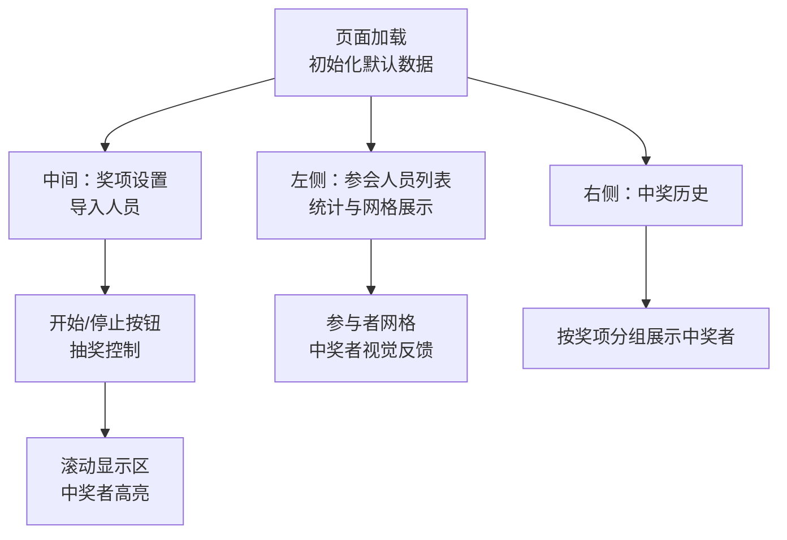
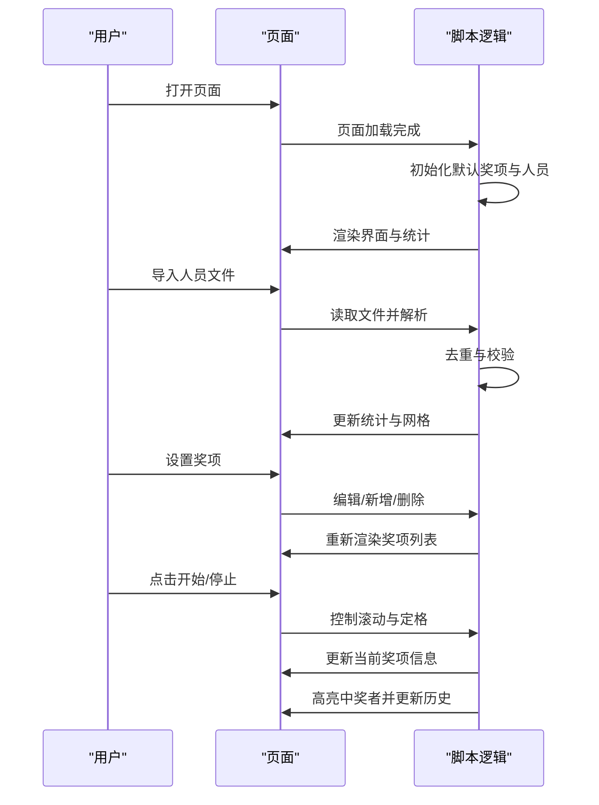
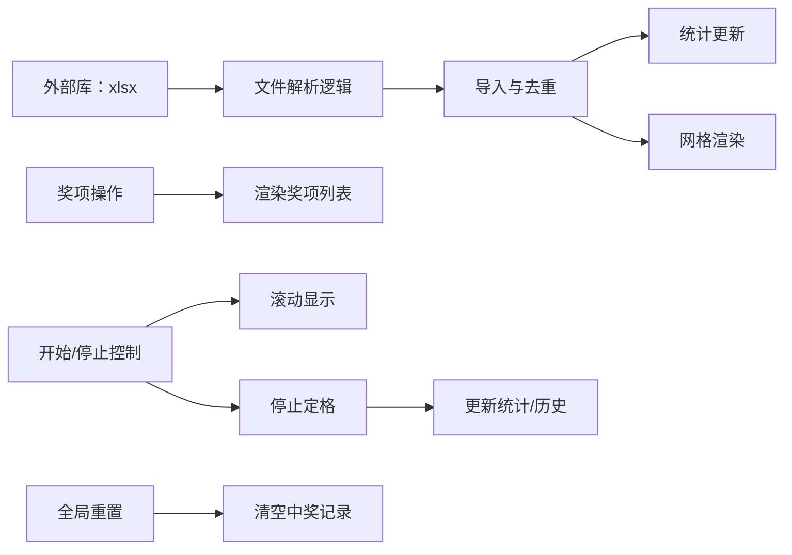

# 使用指南

<cite>
**本文引用的文件**
- [lottery.html](file://lottery.html)
</cite>

## 目录
1. [简介](#简介)
2. [项目结构](#项目结构)
3. [核心组件](#核心组件)
4. [架构概览](#架构概览)
5. [详细组件分析](#详细组件分析)
6. [依赖关系分析](#依赖关系分析)
7. [性能考虑](#性能考虑)
8. [故障排除指南](#故障排除指南)
9. [结论](#结论)
10. [附录](#附录)

## 简介
本指南面向终端用户，帮助您快速上手“年会抽奖系统”。系统采用单页 HTML 实现，无需安装额外依赖，打开即用。通过本指南，您可以完成从初始化到全局重置的完整工作流：设置奖项、导入人员、启动/停止抽奖、查看中奖结果，并掌握常见问题的排查与最佳实践。

## 项目结构
- 单文件应用：所有界面样式、交互逻辑与数据均位于一个 HTML 文件中，便于分发与部署。
- 页面布局分为三列：
  - 左侧：参会人员列表与统计
  - 中间：奖项设置与人员导入
  - 右侧：中奖历史
  - 中央：当前奖项信息、滚动显示区与控制按钮

图表来源
- [lottery.html](file://lottery.html#L590-L1117)

章节来源
- [lottery.html](file://lottery.html#L590-L1117)

## 核心组件
- 奖项管理：支持添加、编辑、删除奖项；每个奖项包含名称、名额与奖品描述。
- 人员导入：支持 TXT 文本文件（每行一个姓名）与 Excel 文件（第一列作为姓名），自动去重并更新统计。
- 抽奖控制：开始/停止按钮驱动滚动与定格，中奖者从剩余人员中移除，自动切换到下一个未抽完的奖项。
- 结果展示：中央滚动区突出显示中奖者，右侧按奖项分组展示中奖名单，左侧网格标注中奖者。
- 全局重置：一键清空中奖记录、恢复剩余人员、回到初始状态。

章节来源
- [lottery.html](file://lottery.html#L670-L1117)

## 架构概览
系统采用前端纯静态实现，数据存储于内存变量，页面元素通过 DOM 操作实时更新。核心流程如下：

图表来源
- [lottery.html](file://lottery.html#L670-L1117)

## 详细组件分析

### 奖项设置（添加、编辑、删除）
- 添加：点击“添加奖项”，系统追加一条默认奖项条目，可直接编辑名称、名额与奖品。
- 编辑：直接修改输入框内容，字段变更即时生效。
- 删除：在某奖项条目点击“删除”，弹窗确认后移除该奖项并刷新列表。
- 视觉反馈：当前奖项信息区域会根据剩余名额动态提示“第 X / Y 位”。

章节来源
- [lottery.html](file://lottery.html#L724-L761)
- [lottery.html](file://lottery.html#L878-L901)

### 人员导入（TXT/Excel）
- 支持格式：.txt（每行一个姓名）、.xlsx/.xls（读取第一个工作表的第一列）。
- 导入步骤：
  1) 点击“导入文件”触发系统文件选择器；
  2) 选择文件后自动解析并去重；
  3) 成功导入后更新总人数、剩余人数、网格与中奖历史。
- 常见问题与解决：
  - TXT 编码问题：确保保存为 UTF-8 编码；若出现乱码，请在文本编辑器中另存为 UTF-8。
  - Excel 解析失败：检查文件是否损坏、是否包含非文本列；仅使用第一列作为姓名。
  - 无有效姓名：TXT 文件需每行一个姓名且去除空白；Excel 文件第一列必须有值。

章节来源
- [lottery.html](file://lottery.html#L763-L834)
- [lottery.html](file://lottery.html#L792-L827)

### 启动抽奖流程（开始/停止）
- 启动条件：必须已设置至少一个奖项且已导入人员，否则会弹出提示。
- 开始滚动：点击“开始抽奖”，按钮变为“停止抽奖”，系统以固定频率随机展示一名剩余人员。
- 停止定格：点击“停止抽奖”，系统记录中奖者、从剩余人员中移除、高亮显示中奖者、更新统计与历史。
- 自动切换：当当前奖项抽满后，自动进入下一个奖项，直至全部奖项抽完。

章节来源
- [lottery.html](file://lottery.html#L903-L990)
- [lottery.html](file://lottery.html#L928-L950)
- [lottery.html](file://lottery.html#L952-L990)

### 查看中奖结果（中奖名单与网格反馈）
- 中央滚动区：中奖者出现时卡片放大并带脉冲高亮，营造视觉焦点。
- 右侧历史：按奖项分组显示中奖者序号与姓名，同时显示奖品描述。
- 左侧网格：中奖者的卡片背景高亮并显示“🏆 奖项名”，未中奖者保持普通样式。

章节来源
- [lottery.html](file://lottery.html#L992-L1004)
- [lottery.html](file://lottery.html#L1006-L1029)
- [lottery.html](file://lottery.html#L847-L875)

### 全局重置
- 功能：清除所有中奖记录、恢复剩余人员、回到初始状态，同时重置按钮与滚动显示区。
- 注意：重置前会弹窗确认，避免误操作。

章节来源
- [lottery.html](file://lottery.html#L1031-L1062)

## 依赖关系分析
- 外部依赖：使用了电子表格解析库用于 Excel 文件读取。
- 内部模块：所有功能集中在单文件脚本中，通过函数解耦，职责清晰。

图表来源
- [lottery.html](file://lottery.html#L670-L1117)

章节来源
- [lottery.html](file://lottery.html#L670-L1117)

## 性能考虑
- 数据规模：系统对人员进行去重与数组过滤，适合中小规模（例如百级）场景；大规模数据可能影响滚动性能与渲染开销。
- 建议：在导入前清理重复姓名，减少不必要的去重成本；避免一次性导入过多重复数据。
- 浏览器兼容：使用现代浏览器即可；动画与样式在主流浏览器表现一致。

## 故障排除指南
- 文件导入失败
  - TXT 编码问题：保存为 UTF-8；若仍乱码，尝试在文本编辑器中转换编码。
  - Excel 解析失败：检查文件是否损坏、列数是否正确、第一列为姓名；仅支持 .xlsx/.xls。
  - 无有效姓名：TXT 每行一个姓名且去除空白；Excel 第一列必须有值。
- 抽奖按钮无响应
  - 未设置奖项或未导入人员：先设置奖项并导入人员后再试。
  - 所有人已抽完：系统提示“所有人员已抽取完毕”，需要重置或补充人员。
- 中奖名单显示异常
  - 网格未更新：确认已成功导入并刷新统计；检查是否有重复姓名导致去重后数量变化。
  - 历史为空：尚未产生中奖记录或已重置；确认已停止一次抽奖并查看右侧历史。
- 页面卡顿
  - 人员过多：建议减少导入人数或优化人员命名，避免大量重复导致去重与渲染压力。

章节来源
- [lottery.html](file://lottery.html#L763-L834)
- [lottery.html](file://lottery.html#L903-L918)
- [lottery.html](file://lottery.html#L934-L937)
- [lottery.html](file://lottery.html#L1031-L1062)

## 结论
本系统以简洁直观的方式实现了年会抽奖的核心流程：从奖项配置到人员导入，再到滚动抽奖与结果可视化。遵循本文的操作步骤与最佳实践，您可以高效地完成整场抽奖活动，并在遇到问题时快速定位与解决。

## 附录

### 快速操作清单
- 初始化：打开页面即完成默认奖项与人员初始化。
- 设置奖项：点击“添加奖项”，编辑名称/名额/奖品。
- 导入人员：点击“导入文件”，选择 TXT 或 Excel。
- 启动/停止：点击“开始抽奖”滚动，再次点击“停止抽奖”定格中奖者。
- 查看结果：中央滚动区高亮中奖者，右侧历史按奖项分组显示，左侧网格标注中奖者。
- 全局重置：点击“全局重置”，确认后清空中奖记录并回到初始状态。

### 最佳实践
- 人员管理：导入前清理重复姓名，确保唯一性；避免空行与多余空白。
- 奖项设计：合理设置各奖项名额，避免抽满过早导致后续奖项无人可抽。
- 文件规范：TXT 使用 UTF-8 编码；Excel 使用第一列作为姓名，确保列头不影响解析。
- 活动节奏：提前测试导入与抽奖流程，确保网络与浏览器环境稳定。