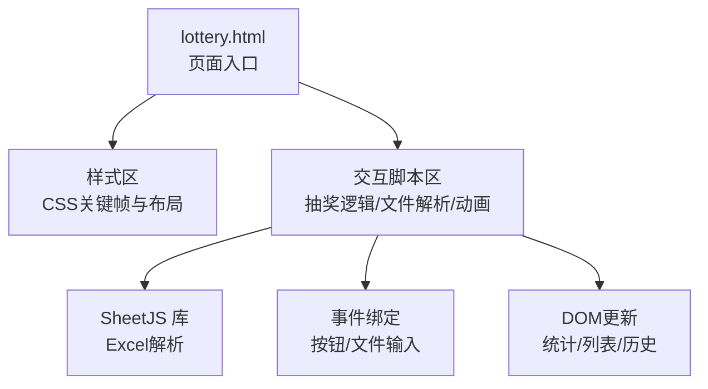
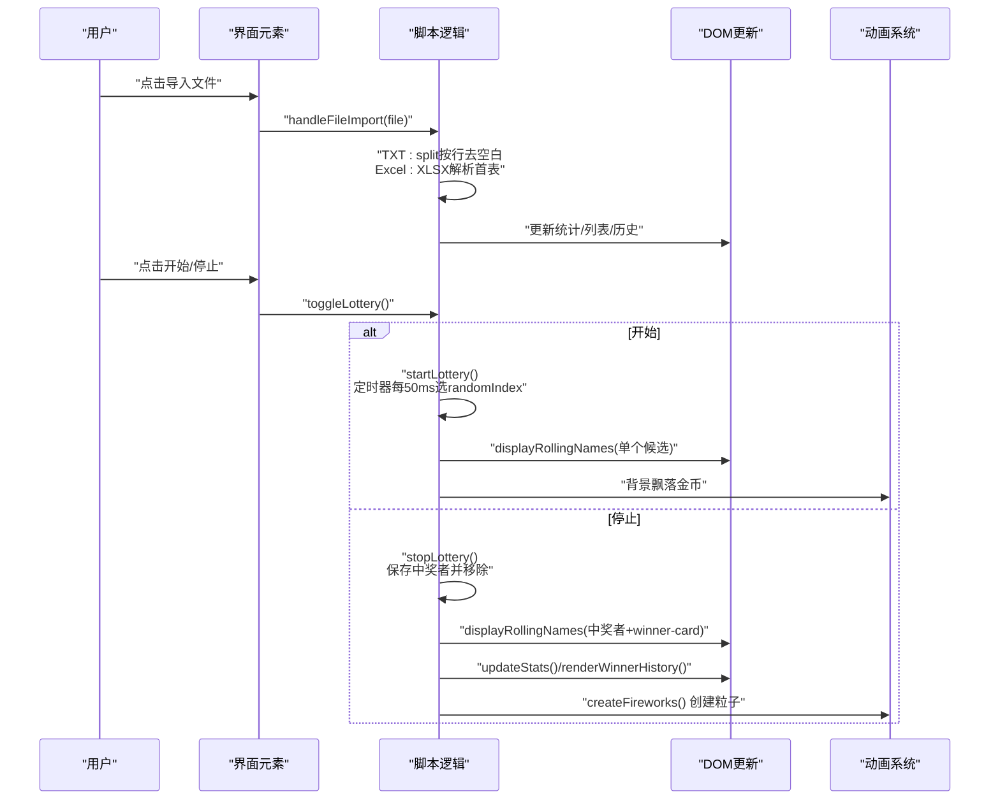
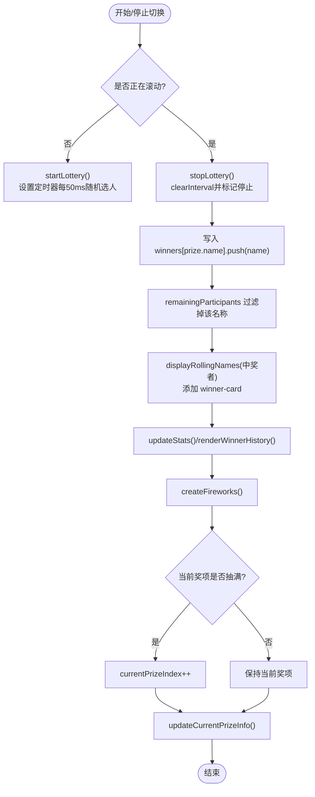
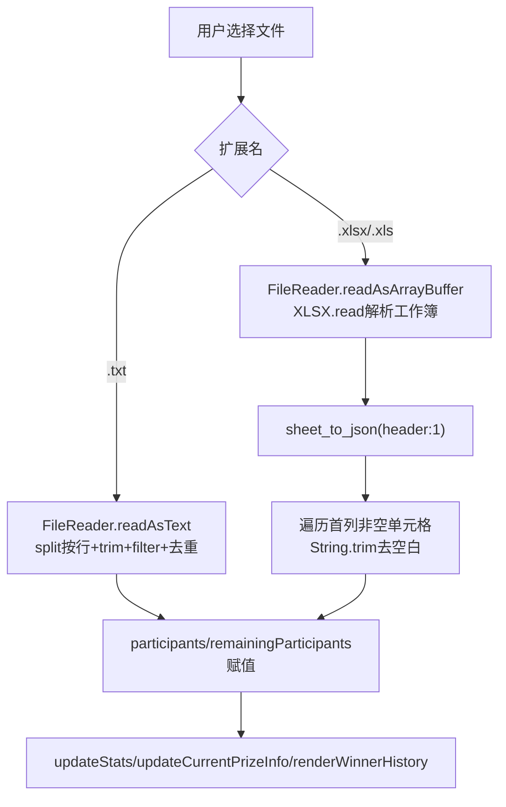
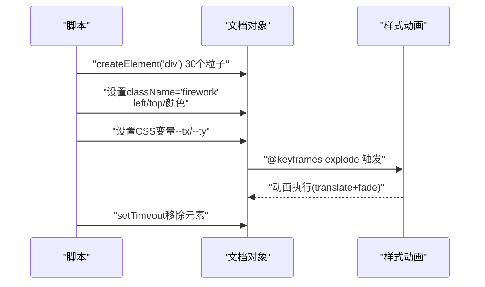
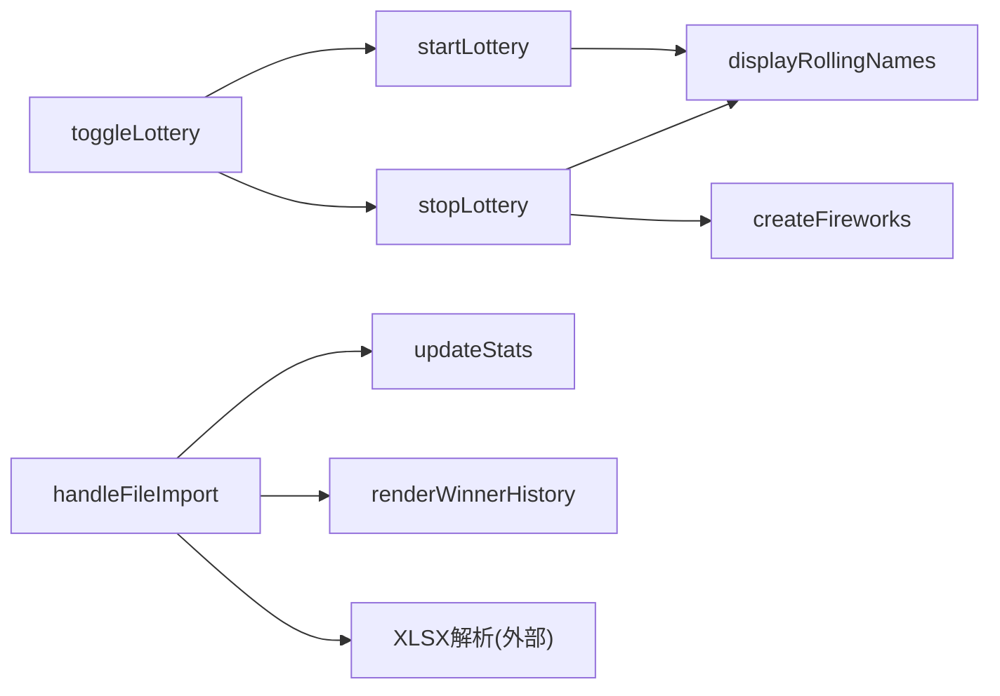

# 关键实现

<cite>
**本文引用的文件**
- [lottery.html](file://lottery.html)
</cite>

## 目录
1. [引言](#引言)
2. [项目结构](#项目结构)
3. [核心组件](#核心组件)
4. [架构总览](#架构总览)
5. [详细组件分析](#详细组件分析)
6. [依赖关系分析](#依赖关系分析)
7. [性能考量](#性能考量)
8. [故障排查指南](#故障排查指南)
9. [结论](#结论)

## 引言
本文件聚焦于系统中的三大关键技术实现：抽奖算法、文件解析（TXT/Excel）、动画效果（CSS关键帧与JavaScript动态粒子）。文档将从代码层面深入剖析这些模块的实现细节，解释如何在 remainingParticipants 中随机选取中奖者并避免重复中奖，如何解析 TXT 文件按行分割以及通过 SheetJS 将 Excel 转换为 JSON 数据，以及如何结合 CSS @keyframes 与 JavaScript 动态创建元素实现烟花粒子与中奖卡片的视觉增强。同时，给出这些功能模块协同工作的流程图与序列图，帮助读者理解端到端的用户体验实现。

## 项目结构
该仓库仅包含一个 HTML 文件，内含完整的前端页面、样式与脚本，无需额外依赖即可运行。页面采用三栏布局，左侧为参会人员列表，中间为奖项设置与人员导入，右侧为中奖历史，主区域用于滚动展示与中奖结果呈现。

图表来源
- [lottery.html](file://lottery.html#L601-L668)
- [lottery.html](file://lottery.html#L670-L671)
- [lottery.html](file://lottery.html#L903-L990)

章节来源
- [lottery.html](file://lottery.html#L601-L668)
- [lottery.html](file://lottery.html#L670-L671)

## 核心组件
- 抽奖算法与状态管理
  - 数据结构：prizes、participants、remainingParticipants、winners、currentPrizeIndex、isRolling、rollingInterval、currentRollingName
  - 关键函数：toggleLottery、startLottery、stopLottery、displayRollingNames、updateCurrentPrizeInfo、resetAll
- 文件解析
  - TXT：FileReader + split 按行分割 + 去重
  - Excel：FileReader + ArrayBuffer + XLSX.read + XLSX.utils.sheet_to_json
- 动画效果
  - CSS：@keyframes（fall、explode、winnerPulse 等）
  - JS：动态创建烟花粒子元素并设置 CSS 变量 --tx/--ty 实现爆炸轨迹

章节来源
- [lottery.html](file://lottery.html#L672-L681)
- [lottery.html](file://lottery.html#L763-L834)
- [lottery.html](file://lottery.html#L903-L990)
- [lottery.html](file://lottery.html#L1064-L1091)

## 架构总览
下图展示了用户操作到最终视觉反馈的端到端流程：导入文件 -> 初始化数据 -> 开始/停止抽奖 -> 展示中奖者 -> 视觉增强（脉冲与烟花）。

图表来源
- [lottery.html](file://lottery.html#L763-L834)
- [lottery.html](file://lottery.html#L903-L990)
- [lottery.html](file://lottery.html#L992-L1004)
- [lottery.html](file://lottery.html#L1064-L1091)
- [lottery.html](file://lottery.html#L1093-L1104)

## 详细组件分析

### 抽奖算法与去重中奖逻辑
- remainingParticipants 的随机选取
  - startLottery 中通过定时器每 50ms 从 remainingParticipants 中随机索引取值，作为当前滚动名，避免重复中奖的关键在于“仅在停止时才移除”。
- 去重与不可重复中奖
  - stopLottery 中将 currentRollingName 写入 winners[prize.name]，并从 remainingParticipants 过滤掉该名称，从而保证同一人员不会重复中奖。
- 奖项进度与轮次提示
  - updateCurrentPrizeInfo 会根据 winners 统计已抽取数量，动态显示“第 N/M 位”，并在当前奖项抽满后自动推进到下一个奖项。
- 重置与回滚
  - resetAll 将 remainingParticipants 回复为初始 participants，清空 winners，重置按钮状态与展示区域。

图表来源
- [lottery.html](file://lottery.html#L928-L950)
- [lottery.html](file://lottery.html#L952-L990)
- [lottery.html](file://lottery.html#L992-L1004)
- [lottery.html](file://lottery.html#L1064-L1091)
- [lottery.html](file://lottery.html#L877-L901)

章节来源
- [lottery.html](file://lottery.html#L672-L681)
- [lottery.html](file://lottery.html#L928-L990)
- [lottery.html](file://lottery.html#L877-L901)
- [lottery.html](file://lottery.html#L1031-L1062)

### 文件解析：TXT 按行分割与 Excel 通过 SheetJS 转 JSON
- TXT 文件处理
  - 使用 FileReader 读取 UTF-8 文本，按换行符分割并 trim 去除空白，过滤空字符串，最后去重并赋值给 participants 与 remainingParticipants。
- Excel 文件处理
  - 使用 FileReader 读取 ArrayBuffer，XLSX.read 解析工作簿，取第一个工作表，XLSX.utils.sheet_to_json 转为二维数组（header: 1），遍历第一列非空单元格转为字符串并 trim，去重后赋值。
- 错误处理
  - 对空数据与异常进行提示与日志输出，保证用户得到明确反馈。

图表来源
- [lottery.html](file://lottery.html#L763-L834)
- [lottery.html](file://lottery.html#L794-L827)

章节来源
- [lottery.html](file://lottery.html#L763-L834)

### 动画效果：CSS @keyframes 与 JavaScript 动态粒子
- 背景装饰与基础动画
  - fall：金币从顶部飘落并旋转，持续无限。
  - explode：烟花粒子从中心向外扩散，透明度由 1 变 0，通过 CSS 变量 --tx/--ty 控制位移。
  - winnerPulse：中奖卡片放大脉冲效果，增强视觉焦点。
- 动态创建与随机分布
  - createFireworks 在窗口上半部随机位置生成 30 个粒子，按均匀角度分布，赋予随机颜色与速度，使用 setTimeout 定时移除，避免内存泄漏。
  - createCoins 在页面顶部容器中批量创建金币元素，设置随机左右位置与动画时长/延迟，形成自然飘落感。

图表来源
- [lottery.html](file://lottery.html#L43-L61)
- [lottery.html](file://lottery.html#L343-L350)
- [lottery.html](file://lottery.html#L1064-L1091)
- [lottery.html](file://lottery.html#L1093-L1104)

章节来源
- [lottery.html](file://lottery.html#L22-L61)
- [lottery.html](file://lottery.html#L337-L350)
- [lottery.html](file://lottery.html#L1064-L1091)
- [lottery.html](file://lottery.html#L1093-L1104)

## 依赖关系分析
- 外部库
  - SheetJS（xlsx）：用于解析 Excel 文件，提供 XLSX.read 与 XLSX.utils.sheet_to_json。
- 内部依赖
  - toggleLottery 依赖 updateCurrentPrizeInfo、startLottery、stopLottery
  - startLottery 依赖 displayRollingNames、remainingParticipants
  - stopLottery 依赖 winners、remainingParticipants、displayRollingNames、createFireworks
  - 文件导入依赖 handleFileImport、updateStats、renderWinnerHistory

图表来源
- [lottery.html](file://lottery.html#L903-L990)
- [lottery.html](file://lottery.html#L763-L834)
- [lottery.html](file://lottery.html#L670-L671)

章节来源
- [lottery.html](file://lottery.html#L903-L990)
- [lottery.html](file://lottery.html#L763-L834)
- [lottery.html](file://lottery.html#L670-L671)

## 性能考量
- 随机选取复杂度
  - remainingParticipants 随机访问为 O(1)，但过滤移除为 O(n)。若参与者规模较大，建议：
    - 使用 Set 存储 remainingParticipants，移除为 O(1)
    - 或维护索引映射，随机后交换到末尾再 pop，整体 O(1)
- DOM 更新频率
  - startLottery 每 50ms 更新一次显示，建议在移动端适当增加间隔或节流
- 动画与粒子
  - createFireworks 一次性创建 30×3 个元素，建议限制并发数量或使用 requestAnimationFrame 控制
- 文件解析
  - 大型 Excel 建议分页读取或预处理，避免主线程阻塞

## 故障排查指南
- Excel 解析失败
  - 现象：弹窗提示“Excel文件解析失败，请确保文件格式正确！”
  - 排查：确认文件为 .xlsx/.xls；检查首表是否存在；查看控制台错误
- TXT 无有效姓名
  - 现象：弹窗提示“文件中没有找到有效的姓名！”
  - 排查：确认文本每行一个姓名，去除多余空行与空白字符
- 无法重复导入同一文件
  - 现象：再次选择相同文件无效
  - 处理：导入后清空 input 的 value，允许重复选择
- 抽奖结束后仍可点击
  - 现象：remainingParticipants 为空时仍可点击
  - 处理：toggleLottery 已做保护，若仍出现，检查 isRolling 状态与按钮文本

章节来源
- [lottery.html](file://lottery.html#L822-L834)
- [lottery.html](file://lottery.html#L777-L791)
- [lottery.html](file://lottery.html#L822-L827)
- [lottery.html](file://lottery.html#L903-L925)

## 结论
本系统通过简洁的数据结构与清晰的流程控制实现了可靠的抽奖体验：remainingParticipants 的随机选取与 stopLottery 的移除逻辑共同确保了“同一人员不会重复中奖”。文件解析模块对 TXT 与 Excel 提供了稳健的处理路径，配合 SheetJS 的高效解析能力。动画模块以 CSS @keyframes 为基础，结合 JavaScript 动态创建粒子，营造了丰富的视觉反馈。三者协同工作，形成了从数据导入到结果展示再到视觉增强的完整闭环，为用户提供流畅且富有仪式感的抽奖体验。