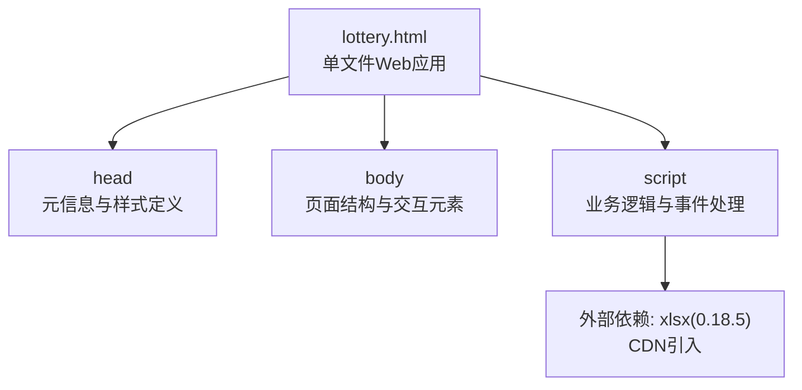
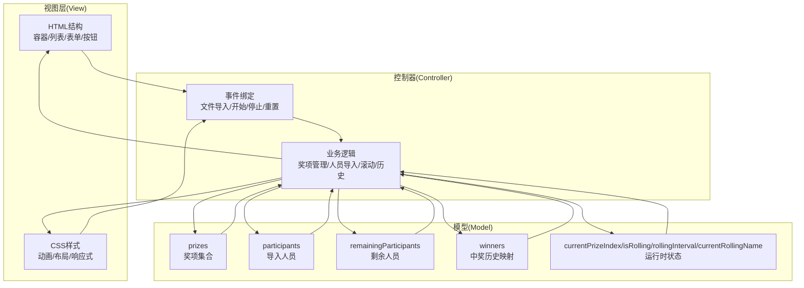
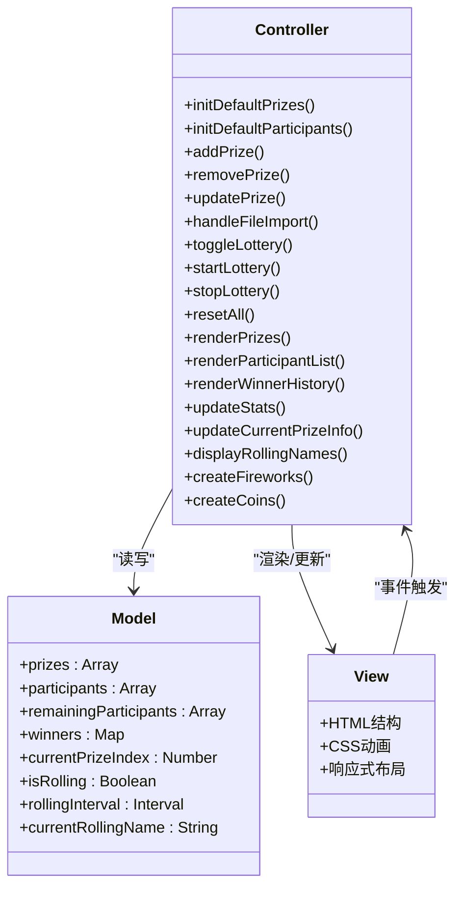
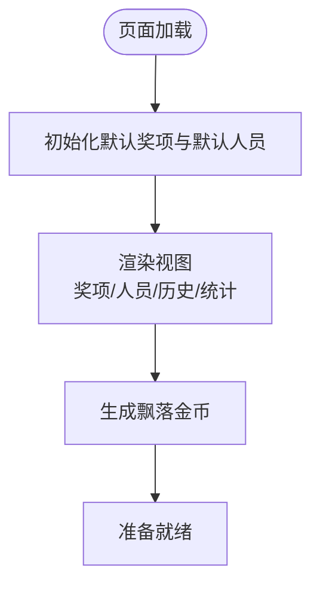
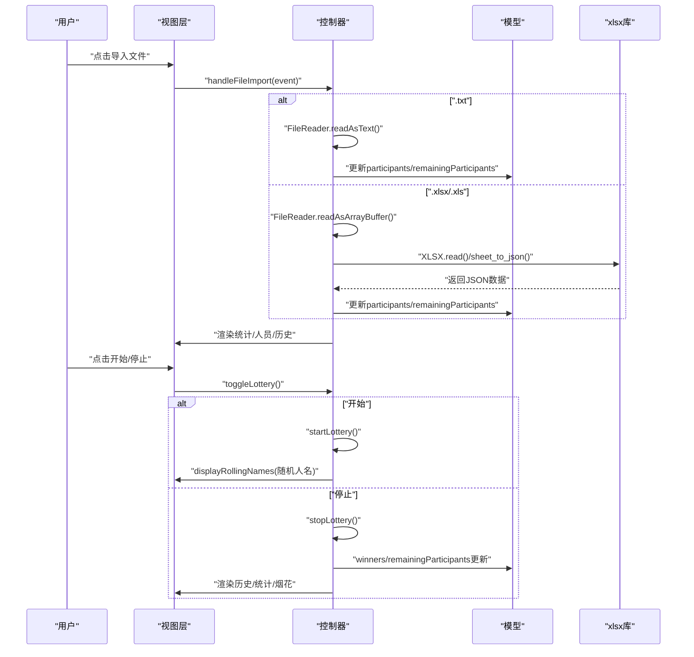
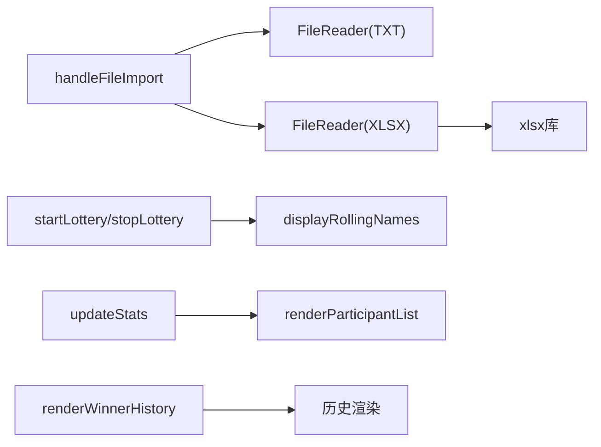

# 技术架构

<cite>
**本文引用的文件**
- [lottery.html](file://lottery.html)
</cite>

## 目录
1. [引言](#引言)
2. [项目结构](#项目结构)
3. [核心组件](#核心组件)
4. [架构总览](#架构总览)
5. [详细组件分析](#详细组件分析)
6. [依赖关系分析](#依赖关系分析)
7. [性能考量](#性能考量)
8. [故障排查指南](#故障排查指南)
9. [结论](#结论)
10. [附录](#附录)

## 引言
本文件面向“年会抽奖系统”的技术架构与实现细节，聚焦于该单文件 Web 应用的结构与交互流程。文档将系统性阐述 MVC 设计模式在项目中的落地：Model（数据模型与状态）、View（HTML/CSS 视图层）、Controller（JavaScript 事件与业务控制逻辑）。同时，深入解析以下关键点：
- 原生 JavaScript 如何驱动 DOM 操作、事件绑定与动态内容更新；
- 外部依赖 SheetJS/xlsx 在 Excel 文件解析中的作用机制；
- FileReader API 在 TXT 与 Excel 文件读取中的实现方式；
- CSS 动画系统（飘落金币、烟花爆炸、按钮悬停效果）的技术实现原理；
- 响应式布局在不同屏幕尺寸下的适配策略。

## 项目结构
该仓库为单文件 Web 应用，所有 HTML、CSS、JavaScript 与外部依赖均内嵌于单一 HTML 文件中，便于部署与分发。文件组织采用“自上而下”的结构：头部包含样式定义与元信息，主体包含页面结构与脚本，底部引入外部库并执行初始化逻辑。

图表来源
- [lottery.html](file://lottery.html#L1-L120)
- [lottery.html](file://lottery.html#L669-L671)

章节来源
- [lottery.html](file://lottery.html#L1-L120)
- [lottery.html](file://lottery.html#L669-L671)

## 核心组件
- Model（数据模型）
  - 奖项集合：包含奖项名称、数量、奖品描述等字段，用于控制每轮抽取配额与进度。
  - 参与人员集合：存储所有导入的姓名，支持去重与统计。
  - 剩余人员集合：基于参与人员集合进行抽取后筛选，保证不重复中奖。
  - 中奖历史映射：按奖项名聚合中奖者列表，用于展示与统计。
  - 当前状态：包括当前奖项索引、是否滚动中、滚动定时器、当前滚动人名等。
- View（视图层）
  - HTML 结构：包含左侧参会人员列表、中间设置区（奖项设置与导入）、主抽奖区（滚动显示与控制）、右侧中奖历史。
  - CSS 样式：网格布局、动画（飘落金币、烟花爆炸、按钮悬停）、响应式断点。
- Controller（控制器）
  - 事件处理：文件导入、开始/停止抽奖、全局重置、动态渲染。
  - 业务逻辑：奖项管理、人员导入与去重、滚动与停止、中奖记录维护、历史渲染与统计更新。

章节来源
- [lottery.html](file://lottery.html#L670-L1117)

## 架构总览
整体采用“单页应用 + 原生 JS + 外部库”的轻量级架构。数据流自上而下：用户通过 UI 触发事件，Controller 接收并更新 Model，随后由 View 层根据 Model 的变化进行渲染与动画反馈。

图表来源
- [lottery.html](file://lottery.html#L600-L668)
- [lottery.html](file://lottery.html#L670-L1117)

## 详细组件分析

### Model 组件分析（数据结构与状态）
- 奖项集合（prizes）
  - 字段：名称、数量、奖品描述。
  - 行为：添加、删除、修改；与剩余人员抽取配额联动。
- 参与人员集合（participants）
  - 来源：TXT 文本逐行拆分或 Excel 第一列提取。
  - 行为：去重、统计总数、渲染卡片。
- 剩余人员集合（remainingParticipants）
  - 行为：每次抽取后移除中奖者，避免重复。
- 中奖历史映射（winners）
  - 结构：键为奖项名，值为该奖项的中奖者数组。
  - 行为：按奖项聚合展示，支持历史累计。
- 运行时状态（currentPrizeIndex、isRolling、rollingInterval、currentRollingName）
  - 行为：控制滚动启动/停止、当前奖项进度、滚动人名展示。

图表来源
- [lottery.html](file://lottery.html#L670-L1117)

章节来源
- [lottery.html](file://lottery.html#L670-L1117)

### View 组件分析（HTML/CSS 与响应式）
- HTML 结构
  - 左侧：参会人员列表与统计卡片。
  - 中间：奖项设置区（增删改查）、导入区（TXT/Excel）、主抽奖区（滚动显示与控制按钮）、重置按钮。
  - 右侧：中奖历史分组展示。
- CSS 动画
  - 飘落金币：使用绝对定位与 keyframe 动画实现持续下降与旋转。
  - 烟花爆炸：创建多个小圆点元素，通过 CSS 变量计算位移向量，配合淡出动画。
  - 按钮悬停：统一 hover/active 效果，增强交互反馈。
- 响应式布局
  - 使用媒体查询在大屏（1200px）与中屏（768px）切换网格布局与字体大小，保证移动端可读性与可用性。

图表来源
- [lottery.html](file://lottery.html#L1-L120)
- [lottery.html](file://lottery.html#L1093-L1114)

章节来源
- [lottery.html](file://lottery.html#L1-L120)
- [lottery.html](file://lottery.html#L565-L589)
- [lottery.html](file://lottery.html#L1093-L1114)

### Controller 组件分析（JavaScript 事件与业务逻辑）
- 文件导入
  - TXT：使用 FileReader.readAsText 读取 UTF-8 文本，按换行符拆分并去重。
  - Excel：使用 FileReader.readAsArrayBuffer 读取二进制数据，借助 xlsx 将首张工作表转为 JSON，取第一列作为姓名。
- 抽奖流程
  - 开始：校验状态，进入滚动模式，定时器每 50ms 切换一个随机剩余人员。
  - 停止：清空定时器，记录中奖者，从剩余人员移除，更新统计与历史，触发烟花动画。
  - 重置：清理状态，恢复初始界面。
- 动态渲染
  - 奖项列表、人员卡片、历史分组、统计数值、当前奖项信息等均通过字符串拼接与 DOM 更新完成。

图表来源
- [lottery.html](file://lottery.html#L763-L834)
- [lottery.html](file://lottery.html#L903-L990)
- [lottery.html](file://lottery.html#L1064-L1091)

章节来源
- [lottery.html](file://lottery.html#L763-L834)
- [lottery.html](file://lottery.html#L903-L990)
- [lottery.html](file://lottery.html#L1064-L1091)

### 外部依赖与 API 实现
- SheetJS/xlsx
  - 作用：将 Excel 文件解析为内存对象，再转换为 JSON 数组，从而提取第一列作为姓名。
  - 使用方式：读取 ArrayBuffer 后调用 XLSX.read，访问第一个工作表，使用 sheet_to_json 转换。
- FileReader API
  - TXT：readAsText，编码 UTF-8，按换行符分割并过滤空行。
  - Excel：readAsArrayBuffer，供 xlsx 解析。
- 错误处理
  - 对空数据、格式错误、用户取消等场景进行提示与日志输出。

章节来源
- [lottery.html](file://lottery.html#L763-L834)
- [lottery.html](file://lottery.html#L669-L671)

### 动画系统与视觉反馈
- 飘落金币
  - 通过循环创建多个 .coin 元素，设置随机起始位置、动画时长与延迟，形成自然飘落效果。
- 烟花爆炸
  - 在随机位置创建多个 .firework 元素，使用 CSS 变量 --tx/--ty 计算位移向量，配合 1s 动画与移除逻辑，模拟爆炸扩散。
- 按钮悬停与脉冲
  - 使用 :hover/:active 状态改变阴影与位移；中奖卡片使用脉冲动画强调获奖者。

章节来源
- [lottery.html](file://lottery.html#L22-L61)
- [lottery.html](file://lottery.html#L1064-L1091)
- [lottery.html](file://lottery.html#L336-L351)

### 响应式布局与适配策略
- 断点策略
  - 大屏（≤1200px）：三栏布局变为单列，参会人员列表上移。
  - 中屏（≤768px）：标题字号、按钮尺寸、网格卡片列宽等进行缩放，保证可读性与点击面积。
- 布局实现
  - 使用 CSS Grid 与媒体查询组合，配合 max-width 与弹性布局，确保内容在不同设备上均匀分布。

章节来源
- [lottery.html](file://lottery.html#L565-L589)

## 依赖关系分析
- 内部依赖
  - 控制器函数之间存在直接调用关系，如 startLottery 调用 displayRollingNames，stopLottery 调用 updateStats/renderWinnerHistory。
- 外部依赖
  - xlsx：仅在 Excel 导入路径中使用，读取与解析流程清晰，异常捕获完善。
- 耦合度评估
  - 控制器与视图通过 DOM 操作耦合，但集中在少量渲染函数中，职责边界明确。
  - 模型与控制器通过状态共享耦合，保持松耦合的数据驱动渲染。

图表来源
- [lottery.html](file://lottery.html#L763-L834)
- [lottery.html](file://lottery.html#L927-L990)
- [lottery.html](file://lottery.html#L836-L875)
- [lottery.html](file://lottery.html#L1006-L1029)

章节来源
- [lottery.html](file://lottery.html#L763-L834)
- [lottery.html](file://lottery.html#L927-L990)
- [lottery.html](file://lottery.html#L836-L875)
- [lottery.html](file://lottery.html#L1006-L1029)

## 性能考量
- DOM 操作频率
  - 滚动阶段每 50ms 更新一次显示区域，建议在更高并发场景下适当增大间隔或使用 requestAnimationFrame 优化。
- 数据规模
  - 导入数据去重与数组过滤在大规模数据下可能成为瓶颈，建议在导入阶段进行预处理或分批渲染。
- 动画开销
  - 烟花与金币数量可控，但大量元素同时动画可能影响性能，建议在低端设备上降低粒子数量或禁用动画。
- 外部库体积
  - xlsx 为完整构建，若仅需读取 Excel，可考虑更精简的替代方案或按需加载。

## 故障排查指南
- Excel 解析失败
  - 现象：弹窗提示“Excel 文件解析失败，请确保文件格式正确！”
  - 排查：确认文件为 .xlsx/.xls；检查首张工作表是否存在；查看浏览器控制台错误日志。
- TXT 导入无有效姓名
  - 现象：弹窗提示“文件中没有找到有效的姓名！”
  - 排查：确认文本每行一个姓名，去除多余空白；检查编码是否为 UTF-8。
- 抽奖无法开始
  - 现象：弹窗提示“请先设置奖项”或“请先导入参与人员”或“所有人员已抽取完毕”
  - 排查：检查奖项是否为空、人员是否导入、剩余人员是否为 0。
- 重置后状态异常
  - 现象：界面未恢复初始状态
  - 排查：确认重置函数已执行，滚动定时器已清理，按钮状态已复位。

章节来源
- [lottery.html](file://lottery.html#L763-L834)
- [lottery.html](file://lottery.html#L903-L990)
- [lottery.html](file://lottery.html#L1031-L1062)

## 结论
该年会抽奖系统以单文件 Web 应用形式实现了完整的抽奖流程，MVC 模式在项目中清晰落地：Model 负责数据与状态，View 负责结构与样式，Controller 负责事件与业务逻辑。通过原生 JavaScript 与 SheetJS/xlsx 的结合，系统实现了对 TXT 与 Excel 文件的灵活导入；通过 CSS 动画与响应式布局，提供了良好的视觉体验与跨设备适配。建议在未来版本中进一步优化大规模数据处理与动画性能，并提供更丰富的导入模板与导出能力。

## 附录
- 关键函数与职责速览
  - 奖项管理：initDefaultPrizes、addPrize、removePrize、updatePrize、renderPrizes
  - 人员导入：handleFileImport（TXT/Excel 分支）
  - 抽奖控制：toggleLottery、startLottery、stopLottery
  - 渲染与统计：updateStats、renderParticipantList、updateCurrentPrizeInfo、renderWinnerHistory、displayRollingNames
  - 视觉反馈：createFireworks、createCoins
  - 全局重置：resetAll

章节来源
- [lottery.html](file://lottery.html#L670-L1117)