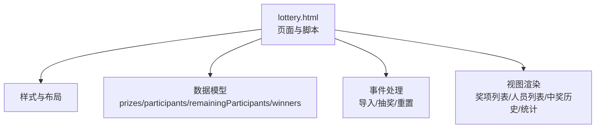
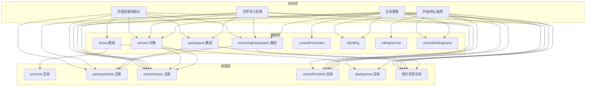
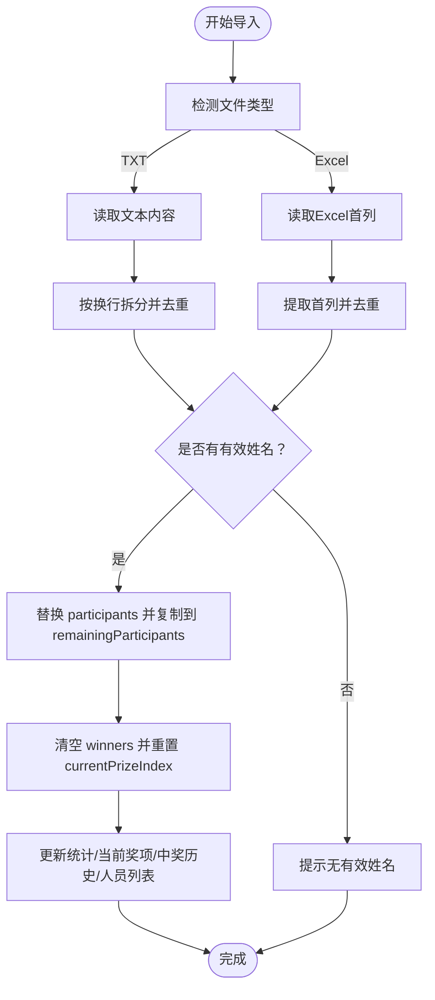
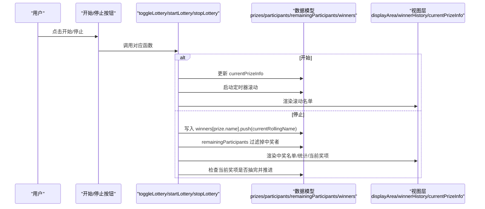
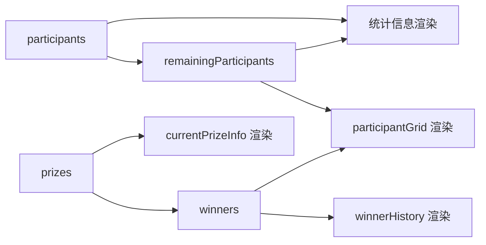

# 数据结构

<cite>
**本文引用的文件**
- [lottery.html](file://lottery.html)
</cite>

## 目录
1. [简介](#简介)
2. [项目结构](#项目结构)
3. [核心组件](#核心组件)
4. [架构总览](#架构总览)
5. [详细组件分析](#详细组件分析)
6. [依赖分析](#依赖分析)
7. [性能考虑](#性能考虑)
8. [故障排查指南](#故障排查指南)
9. [结论](#结论)

## 简介
本文件面向“年会抽奖系统”的前端实现，聚焦于系统中的核心数据模型：prizes 数组、participants 数组、remainingParticipants 数组与 winners 对象。文档将：
- 逐项说明 prizes 数组中每个奖项对象的字段定义与业务含义；
- 解释 participants 与 remainingParticipants 的关系及数据同步机制；
- 描述 winners 对象的嵌套结构设计，如何按奖项名称组织中奖者列表；
- 说明这些数据结构在页面生命周期中的初始化过程（默认奖项与示例人员生成），以及在用户操作（文件导入、抽奖执行）时的变更逻辑；
- 提供数据结构变更时视图更新的响应机制说明（如中奖后 remainingParticipants 的减少与 winners 的增加）。

## 项目结构
该仓库仅包含一个 HTML 文件，内含完整的样式与脚本逻辑，用于实现抽奖系统的前端交互与数据管理。

图表来源
- [lottery.html](file://lottery.html#L1-L1117)

章节来源
- [lottery.html](file://lottery.html#L1-L1117)

## 核心组件
本节对四大核心数据结构进行定义与职责说明，并给出其在页面生命周期中的初始化位置与关键变更点。

- prizes 数组
  - 定义：数组元素为奖项对象，包含 name、count、gift 字段。
  - 业务含义：
    - name：奖项名称（例如“三等奖”、“一等奖”等）。
    - count：该奖项的名额数量（即该奖项应抽取的人数）。
    - gift：奖品名称（可选，用于展示）。
  - 初始化：页面加载时调用初始化函数生成默认奖项列表。
  - 关键变更：用户通过界面添加/删除/修改奖项时，prizes 会被直接更新，随后触发渲染。

- participants 数组
  - 定义：所有参与抽奖的人员名单。
  - 业务含义：系统运行期间不会被修改，作为“全量人员”的基准集合。
  - 初始化：页面加载时生成默认示例人员（去重并保证数量）。
  - 关键变更：当用户导入外部文件（TXT/Excel）时，会替换为导入的新名单，并同步重置 remainingParticipants 与 winners。

- remainingParticipants 数组
  - 定义：当前尚未中奖的人员名单。
  - 业务含义：随着每次抽奖的进行，中奖者会从该数组中移除，直至清空。
  - 初始化：页面加载时复制自 participants。
  - 关键变更：每次停止抽奖并确认中奖者后，会从该数组中移除该中奖者；全局重置时恢复为 participants 的副本。

- winners 对象
  - 定义：以“奖项名称”为键，值为该奖项的中奖者数组的对象。
  - 业务含义：按奖项维度组织中奖者列表，便于展示与统计。
  - 初始化：页面加载时不包含任何中奖者；导入文件时也会被重置为空。
  - 关键变更：每次停止抽奖并确认中奖者后，将当前滚动出的人员追加到对应奖项的中奖者列表；全局重置时清空。

章节来源
- [lottery.html](file://lottery.html#L672-L721)
- [lottery.html](file://lottery.html#L763-L834)
- [lottery.html](file://lottery.html#L837-L875)
- [lottery.html](file://lottery.html#L903-L1062)

## 架构总览
下图展示了数据模型与视图层之间的关系，以及主要流程节点（初始化、导入、抽奖、重置）对数据结构的影响。

图表来源
- [lottery.html](file://lottery.html#L672-L1117)

## 详细组件分析

### 奖项对象（prizes 数组元素）
- 字段定义与业务含义
  - name：奖项名称，用于展示与分组。
  - count：该奖项的名额数量，决定该奖项抽取轮次的上限。
  - gift：奖品名称，用于展示。
- 初始化与变更
  - 默认初始化：页面加载时生成默认奖项列表，随后渲染到界面。
  - 用户操作：通过界面按钮添加/删除奖项，或直接编辑输入框修改名称与名额；修改 count 时会强制为正整数。
- 视图联动
  - 奖项列表渲染依赖 prizes 数组；当前奖项信息渲染依赖 prizes 与 winners 的组合计算。

章节来源
- [lottery.html](file://lottery.html#L683-L721)
- [lottery.html](file://lottery.html#L724-L761)
- [lottery.html](file://lottery.html#L877-L901)

### 参与人员与剩余人员（participants 与 remainingParticipants）
- 关系与一致性
  - remainingParticipants 是 participants 的副本，二者初始一致。
  - 当发生中奖时，中奖者从 remainingParticipants 中移除；导入新名单时，remainingParticipants 会重置为新名单的副本。
- 同步机制
  - 导入文件：替换 participants 后，立即复制到 remainingParticipants，并清空 winners、重置 currentPrizeIndex。
  - 抽奖结束：将当前滚动的中奖者追加到 winners 对应奖项列表，并从 remainingParticipants 过滤掉该中奖者。
  - 全局重置：将 remainingParticipants 恢复为 participants 的副本，清空 winners，重置 currentPrizeIndex。
- 视图联动
  - 统计信息同时反映 participants 与 remainingParticipants 的差值（已中奖人数）。
  - 人员卡片根据是否在 winners 中出现，标注“已中奖”状态。

章节来源
- [lottery.html](file://lottery.html#L693-L721)
- [lottery.html](file://lottery.html#L763-L834)
- [lottery.html](file://lottery.html#L952-L990)
- [lottery.html](file://lottery.html#L1031-L1062)
- [lottery.html](file://lottery.html#L837-L875)

### 中奖者组织（winners 对象）
- 结构设计
  - 键：奖项名称（字符串）。
  - 值：该奖项的中奖者数组（字符串数组）。
- 使用方式
  - 新增中奖者：若该奖项键不存在则创建空数组，再 push 当前滚动的中奖者。
  - 展示中奖历史：按 prizes 的顺序遍历 winners，渲染每个奖项的中奖者列表与奖品信息。
- 视图联动
  - 中奖历史渲染依赖 winners 与 prizes；人员卡片渲染依赖 winners 生成的“中奖者映射”。

章节来源
- [lottery.html](file://lottery.html#L952-L990)
- [lottery.html](file://lottery.html#L1006-L1029)
- [lottery.html](file://lottery.html#L848-L875)

### 页面生命周期中的初始化
- 默认奖项初始化
  - 在页面加载时调用初始化函数，生成默认奖项列表并渲染。
- 默认人员初始化
  - 生成示例人员（去重并保证数量），随后复制到 remainingParticipants，并更新统计与视图。
- 初始视图渲染
  - 初始化完成后，渲染当前奖项信息、中奖历史、人员列表，并创建背景装饰。

章节来源
- [lottery.html](file://lottery.html#L683-L721)
- [lottery.html](file://lottery.html#L1106-L1117)

### 用户操作对数据结构的变更逻辑

#### 文件导入（TXT/Excel）
- 处理流程
  - TXT：按换行拆分，去除空白，去重后写入 participants。
  - Excel：读取第一个工作表首列，拼接为姓名列表，去重后写入 participants。
  - 同步更新：remainingParticipants 赋为 participants 的副本；winners 清空；currentPrizeIndex 归零；更新统计、当前奖项信息、中奖历史与人员列表。
- 异常处理：空文件、格式错误、解析异常均给出提示并避免破坏现有数据。

图表来源
- [lottery.html](file://lottery.html#L763-L834)

章节来源
- [lottery.html](file://lottery.html#L763-L834)

#### 抽奖执行（开始/停止）
- 开始滚动
  - 若当前奖项已抽完，则自动推进到下一个奖项；若所有奖项都已抽完，则提示结束。
  - 启动定时器，随机从 remainingParticipants 中选取人员进行滚动展示。
- 停止滚动并确认中奖
  - 将当前滚动的人员加入 winners 对应奖项的中奖者列表。
  - 从 remainingParticipants 中移除该中奖者。
  - 更新统计、中奖历史与当前奖项信息；若当前奖项名额已满，自动推进到下一个奖项。
- 视图联动
  - 滚动区域显示当前滚动人员；中奖后高亮并播放烟花特效；人员卡片标记为“已中奖”。

图表来源
- [lottery.html](file://lottery.html#L903-L1062)

章节来源
- [lottery.html](file://lottery.html#L903-L1062)

#### 全局重置
- 行为：停止滚动、将 remainingParticipants 恢复为 participants 的副本、清空 winners、重置 currentPrizeIndex、重置按钮状态、清空滚动显示区域、重新渲染统计与视图。
- 视图联动：重置后恢复到初始状态，便于重新开始一轮抽奖。

章节来源
- [lottery.html](file://lottery.html#L1031-L1062)

### 视图更新的响应机制
- 统计信息更新：updateStats 计算已中奖人数（participants.length - remainingParticipants.length），并同步更新多个统计标签与人员列表。
- 人员列表更新：renderParticipantList 根据 winners 生成“中奖者映射”，为中奖者卡片添加“已中奖”样式与奖标签。
- 中奖历史更新：renderWinnerHistory 按 prizes 顺序渲染每个奖项的中奖者列表与奖品信息。
- 当前奖项信息更新：updateCurrentPrizeInfo 根据 winners 的长度与 prizes 的 count 计算剩余名额，并自动推进到下一个未抽完的奖项。

章节来源
- [lottery.html](file://lottery.html#L837-L875)
- [lottery.html](file://lottery.html#L848-L875)
- [lottery.html](file://lottery.html#L1006-L1029)
- [lottery.html](file://lottery.html#L877-L901)

## 依赖分析
- 数据耦合关系
  - remainingParticipants 依赖 participants 的副本；两者在导入与重置时保持同步。
  - winners 依赖 prizes 的名称键；渲染中奖历史时严格按 prizes 的顺序输出。
  - currentPrizeIndex 与 isRolling 控制抽奖状态；rollingInterval 与 currentRollingName 为滚动过程中的临时状态。
- 外部依赖
  - Excel 导入使用第三方库进行解析，需确保网络可用。
- 循环依赖
  - 未发现循环依赖；各函数通过数据模型进行单向更新。

图表来源
- [lottery.html](file://lottery.html#L672-L1117)

章节来源
- [lottery.html](file://lottery.html#L672-L1117)

## 性能考虑
- 数据规模
  - 默认示例人员数量固定，导入文件时建议控制在合理范围，避免一次性渲染过多卡片导致卡顿。
- 渲染策略
  - 人员列表与中奖历史采用按需渲染（导入、统计、停止抽奖、重置时触发），避免频繁全量重绘。
- 滚动性能
  - 滚动定时器频率适中，避免过高导致 CPU 占用；停止后及时清理定时器。
- 建议
  - 大规模数据导入时，可考虑分批渲染或虚拟滚动（当前实现未采用）。
  - Excel 导入解析异常时及时提示，避免长时间阻塞。

## 故障排查指南
- 导入文件为空或无有效姓名
  - 现象：提示无有效姓名或解析失败。
  - 排查：检查文件编码、换行符、Excel 首列是否为空。
- Excel 解析失败
  - 现象：提示解析失败并打印错误日志。
  - 排查：确认文件格式为 .xlsx 或 .xls，且首列包含姓名。
- 抽奖时提示“所有人员已抽取完毕”
  - 现象：remainingParticipants 为空。
  - 排查：确认是否已完成全部奖项抽取；可通过重置恢复。
- 奖项抽完但未自动切换
  - 现象：当前奖项信息未更新。
  - 排查：确认 winners 中该奖项的中奖人数达到 count；停止抽奖后会自动推进。

章节来源
- [lottery.html](file://lottery.html#L763-L834)
- [lottery.html](file://lottery.html#L903-L990)

## 结论
本系统通过四个核心数据结构实现了清晰的抽奖流程管理：prizes 提供奖项规则，participants 与 remainingParticipants 保障抽选范围，winners 以奖项维度组织中奖结果。页面生命周期中，初始化默认数据并渲染视图；用户导入文件与执行抽奖时，数据结构按既定规则变更，视图随之响应更新。整体设计简洁、职责明确，适合在小型场景中快速落地与扩展。