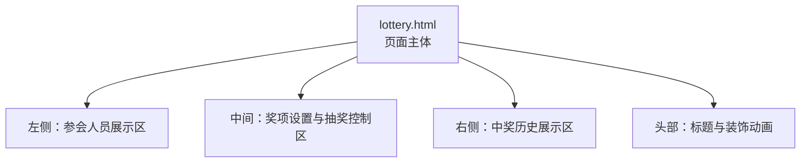
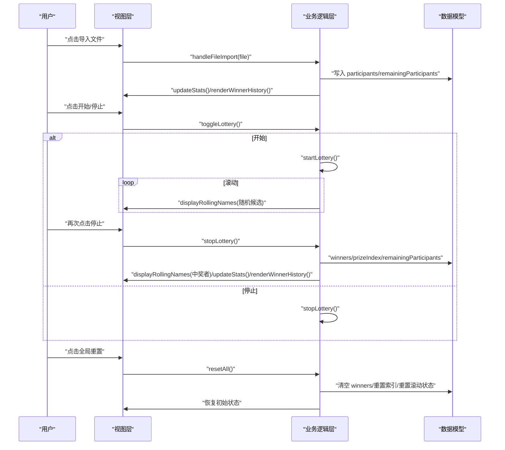
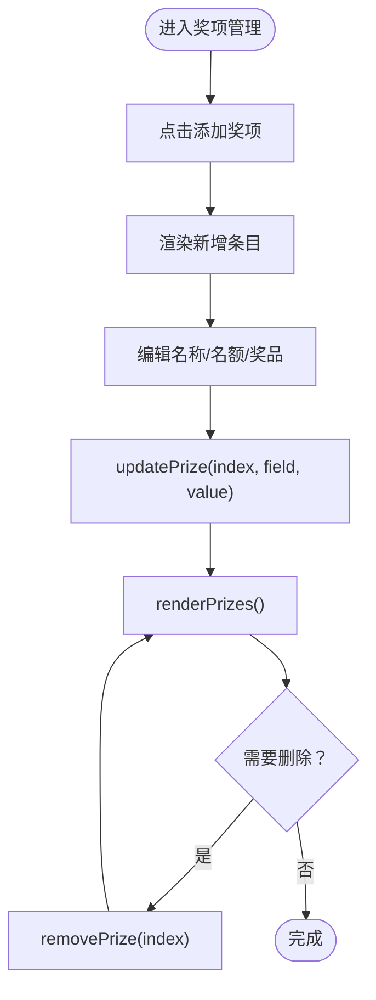
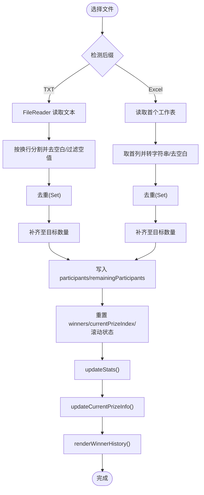
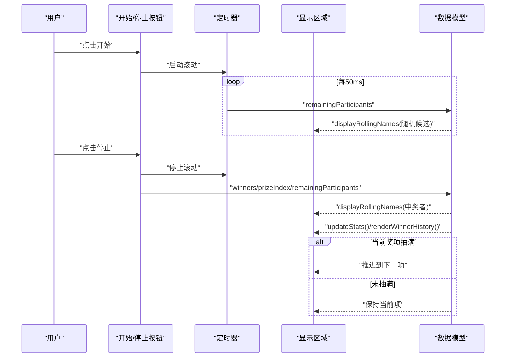
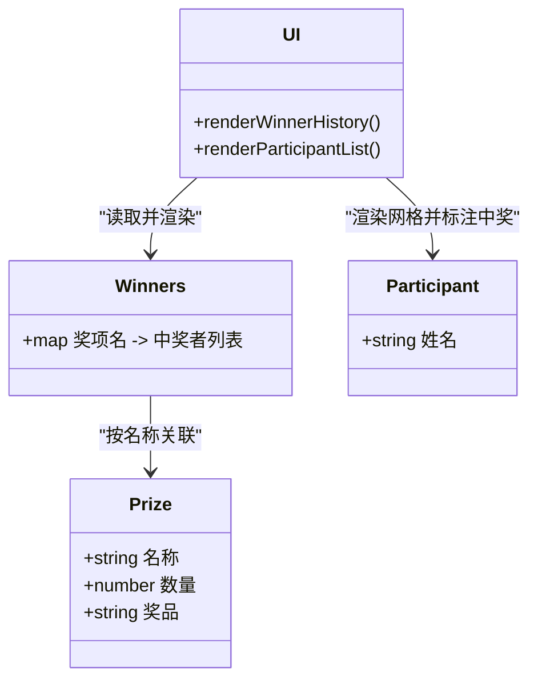
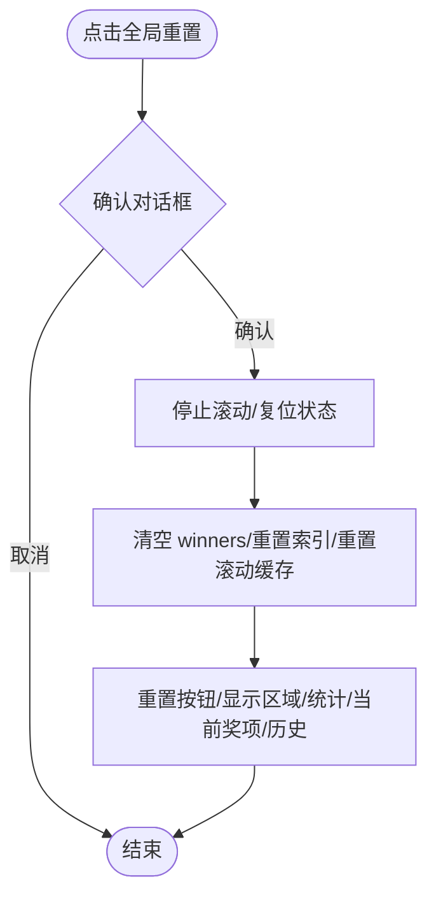
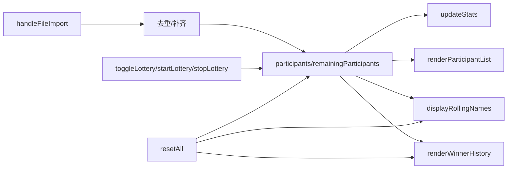

# 核心功能

<cite>
**本文引用的文件**
- [lottery.html](file://lottery.html)
</cite>

## 目录
1. [简介](#简介)
2. [项目结构](#项目结构)
3. [核心组件](#核心组件)
4. [架构总览](#架构总览)
5. [详细组件分析](#详细组件分析)
6. [依赖分析](#依赖分析)
7. [性能考虑](#性能考虑)
8. [故障排查指南](#故障排查指南)
9. [结论](#结论)
10. [附录](#附录)

## 简介
本文件围绕年会抽奖系统的五大核心功能模块进行深入说明：奖项管理、人员导入、抽奖流程、中奖记录、系统重置。通过对单一页面文件的代码级分析，梳理数据结构、处理逻辑、事件流转与界面交互，帮助开发者与使用者理解系统行为与扩展点。

## 项目结构
- 项目为单页应用，所有功能均在单一 HTML 文件中实现，包含样式、模板与脚本。
- 关键区域划分：
  - 左侧：参会人员展示区（含统计与卡片列表）
  - 中间：奖项设置与抽奖控制区（含当前奖项信息、开始/停止按钮、全局重置）
  - 右侧：中奖历史分组展示区
  - 顶部：标题与背景装饰（动画金币与烟花）

图表来源
- [lottery.html](file://lottery.html#L590-L1117)

章节来源
- [lottery.html](file://lottery.html#L590-L1117)

## 核心组件
- 数据模型
  - 奖项数组：包含名称、数量、奖品描述等字段
  - 参会人员数组：导入后的原始名单
  - 剩余人员数组：当前可抽取的候选名单
  - 中奖映射：按奖项名聚合中奖者列表
  - 当前奖项索引：指示当前正在抽取的奖项
  - 抽奖状态标志与定时器：控制滚动与停止
- 视图渲染
  - 奖项列表渲染与编辑
  - 参会人员网格渲染与中奖标记
  - 当前奖项信息展示
  - 中奖历史分组渲染
  - 抽奖区域滚动显示与中奖高亮
- 事件与流程
  - 文件导入（TXT/Excel）与数据清洗
  - 抽奖开始/停止的交互与随机算法
  - 中奖记录存储与实时更新
  - 全局重置的清理与回滚

章节来源
- [lottery.html](file://lottery.html#L670-L1117)

## 架构总览
系统采用“数据驱动视图”的前端架构，所有交互通过事件触发函数修改内存数据，再由渲染函数统一更新 DOM。核心数据流如下：

图表来源
- [lottery.html](file://lottery.html#L763-L1062)

## 详细组件分析

### 奖项管理
- 功能目标
  - 支持新增、删除、修改奖项名称、名额与奖品描述
  - 实时渲染并响应用户输入变化
- 数据结构与更新机制
  - 内存数组维护奖项集合
  - 输入变更直接调用更新函数，随后重新渲染列表
  - 删除操作带确认提示，避免误删
- 界面交互
  - 每个奖项行包含名称输入框、名额输入框与删除按钮
  - 新增按钮追加一条默认配置的奖项条目
- 与抽奖流程的关系
  - 当前奖项信息根据数组索引与中奖映射动态计算剩余名额
  - 奖项顺序决定抽取顺序，抽完自动推进到下一项

图表来源
- [lottery.html](file://lottery.html#L723-L761)

章节来源
- [lottery.html](file://lottery.html#L723-L761)

### 人员导入
- 支持格式
  - TXT：按换行分割，逐行去空白后过滤空值
  - Excel：读取第一个工作表，取第一列作为姓名，统一转字符串并去空白
- 数据清洗
  - 去重：使用集合去重，保证唯一性
  - 容量保障：若去重后不足目标数量，补充生成唯一姓名至目标规模
  - 清空状态：导入后重置中奖映射、当前奖项索引与滚动状态
- 错误处理
  - 空文件或无有效行：弹窗提示
  - 非支持格式：提示不支持
  - Excel 解析异常：捕获错误并提示
- 与视图联动
  - 更新统计（总人数、剩余、已中奖）
  - 刷新当前奖项信息
  - 渲染中奖历史（清空）
  - 重置抽奖区域显示

图表来源
- [lottery.html](file://lottery.html#L763-L834)

章节来源
- [lottery.html](file://lottery.html#L763-L834)

### 抽奖流程
- 启停控制
  - 初始状态：按钮显示“开始”，样式为启动态
  - 开始：切换为停止态，启动定时器进行滚动
  - 停止：清除定时器，切换回开始态
- 随机算法
  - 从剩余人员数组中随机选取一个索引，显示该候选
  - 滚动间隔固定，保证视觉流畅
- 视觉反馈
  - 抽奖区域居中大字显示滚动人名
  - 中奖者卡片高亮并伴随脉冲动画
  - 中奖后创建烟花特效
- 中奖记录与进度推进
  - 停止时将当前滚动人名加入对应奖项的中奖列表
  - 从剩余人员中移除该中奖者
  - 若当前奖项已抽满，则自动推进到下一个奖项
  - 实时更新统计与历史展示

图表来源
- [lottery.html](file://lottery.html#L903-L990)

章节来源
- [lottery.html](file://lottery.html#L903-L990)

### 中奖记录
- 存储结构
  - 使用对象映射，键为奖项名称，值为该奖项的中奖者数组
- 展示方式
  - 按奖项分组，每组显示奖项名称、已抽人数/总配额、奖品描述
  - 组内按顺序展示中奖者标签
- 实时更新策略
  - 每次中奖后立即更新映射、统计与历史区域
  - 当前奖项信息根据映射与配额动态计算剩余
- 与参会人员展示的联动
  - 参会人员网格根据映射标注“中奖”状态与奖标签

图表来源
- [lottery.html](file://lottery.html#L1006-L1029)
- [lottery.html](file://lottery.html#L847-L875)

章节来源
- [lottery.html](file://lottery.html#L1006-L1029)
- [lottery.html](file://lottery.html#L847-L875)

### 系统重置
- 触发条件
  - 用户点击“全局重置”按钮，弹窗确认
- 清理范围
  - 停止滚动定时器并复位状态
  - 重置剩余人员为完整名单
  - 清空中奖映射与当前奖项索引
  - 清空滚动中的人名缓存
  - 回复按钮文字与样式
  - 清空显示区域提示
  - 重新渲染统计、当前奖项信息与历史
- 与导入/抽奖流程的关系
  - 重置后回到初始状态，可重新导入与抽奖

图表来源
- [lottery.html](file://lottery.html#L1031-L1062)

章节来源
- [lottery.html](file://lottery.html#L1031-L1062)

## 依赖分析
- 外部依赖
  - Excel 解析依赖第三方库（通过 CDN 引入），用于读取 Excel 文件并转换为 JSON
- 内部依赖关系
  - 奖项管理依赖渲染函数与数据模型
  - 人员导入依赖文件读取与数据清洗函数
  - 抽奖流程依赖随机算法、定时器与视图更新
  - 中奖记录依赖映射与分组渲染
  - 系统重置依赖所有状态的回滚与视图刷新

图表来源
- [lottery.html](file://lottery.html#L763-L1062)

章节来源
- [lottery.html](file://lottery.html#L763-L1062)

## 性能考虑
- 数据规模
  - 去重与补齐在小规模（百级）场景下开销可控
  - 随机滚动使用索引访问，时间复杂度 O(1)，适合高频更新
- 渲染优化
  - 使用一次性拼接 HTML 字符串减少多次 DOM 操作
  - 分组渲染中奖历史，避免全量重绘
- 动画与资源
  - 烟花与金币动画基于少量元素创建/销毁，注意在移动端的性能影响
- 建议
  - 大规模数据导入建议分批处理或增加进度提示
  - 高频滚动时可适当调整滚动间隔以平衡流畅度与 CPU 占用

## 故障排查指南
- 导入无反应
  - 检查文件格式是否为 .txt 或 .xlsx/.xls
  - 确认文件内容是否包含有效姓名（非空且去空白后有效）
- Excel 解析失败
  - 确认文件为合法工作簿，且至少存在一个工作表
  - 确认首列包含姓名数据
- 抽奖无法开始
  - 是否已设置奖项且导入了人员
  - 是否已抽完所有剩余人员
- 中奖记录不更新
  - 检查是否已停止滚动并产生中奖者
  - 确认中奖映射中对应奖项键是否存在
- 重置无效
  - 确认是否点击了确认对话框
  - 检查定时器是否被正确清除

章节来源
- [lottery.html](file://lottery.html#L763-L834)
- [lottery.html](file://lottery.html#L903-L990)
- [lottery.html](file://lottery.html#L1031-L1062)

## 结论
该系统以简洁的单页实现完成了年会抽奖的核心需求：灵活的奖项管理、可靠的人员导入与清洗、流畅的抽奖交互与可视化反馈、清晰的中奖记录分组展示，以及完整的全局重置能力。通过数据驱动与事件驱动相结合的方式，系统具备良好的可维护性与扩展性。

## 附录
- 初始化流程
  - 页面加载时自动初始化默认奖项与默认参会人员
  - 渲染当前奖项信息、中奖历史与参会人员网格
  - 创建背景装饰动画

章节来源
- [lottery.html](file://lottery.html#L1106-L1117)