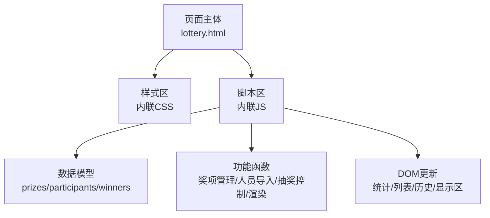
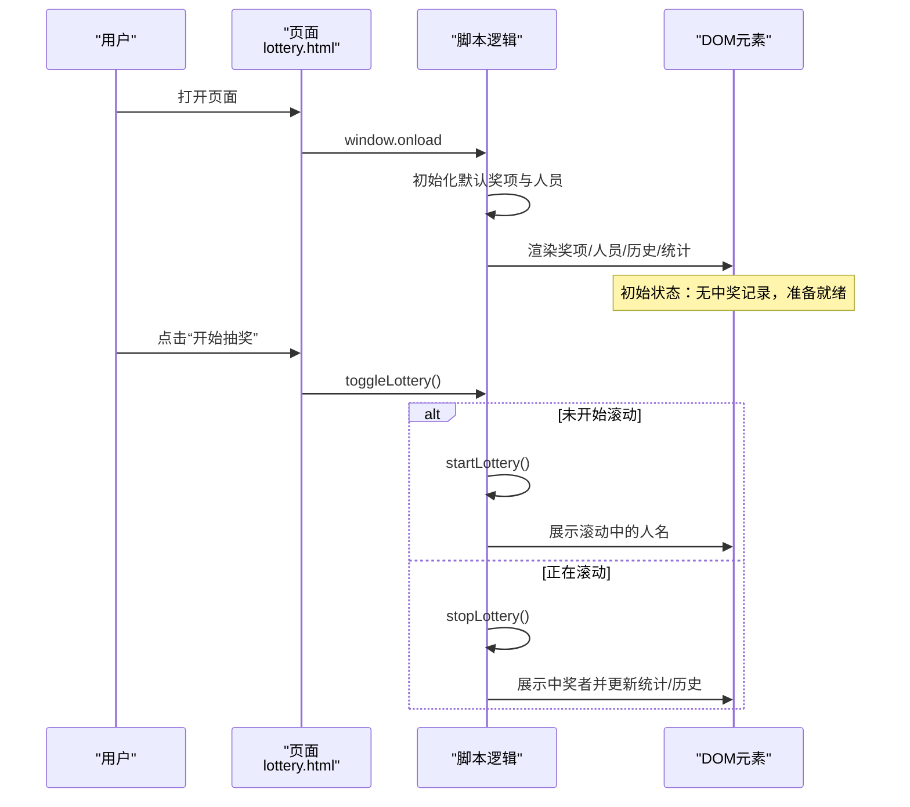
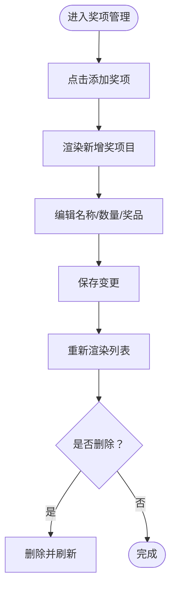
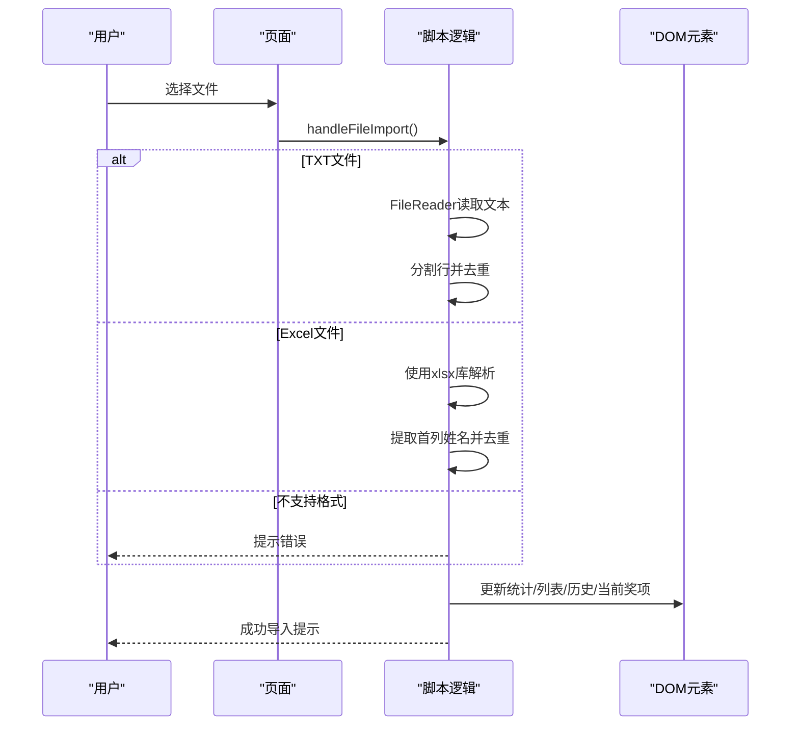
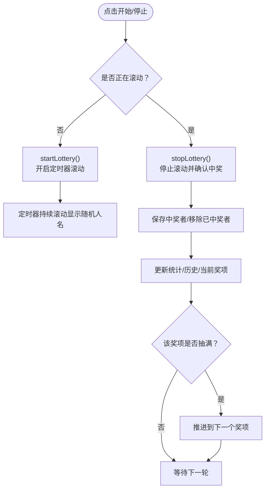
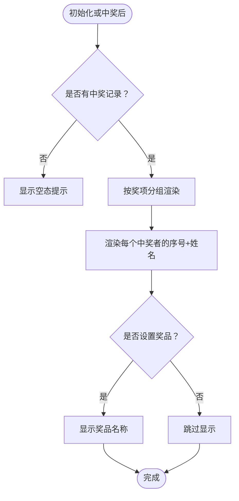
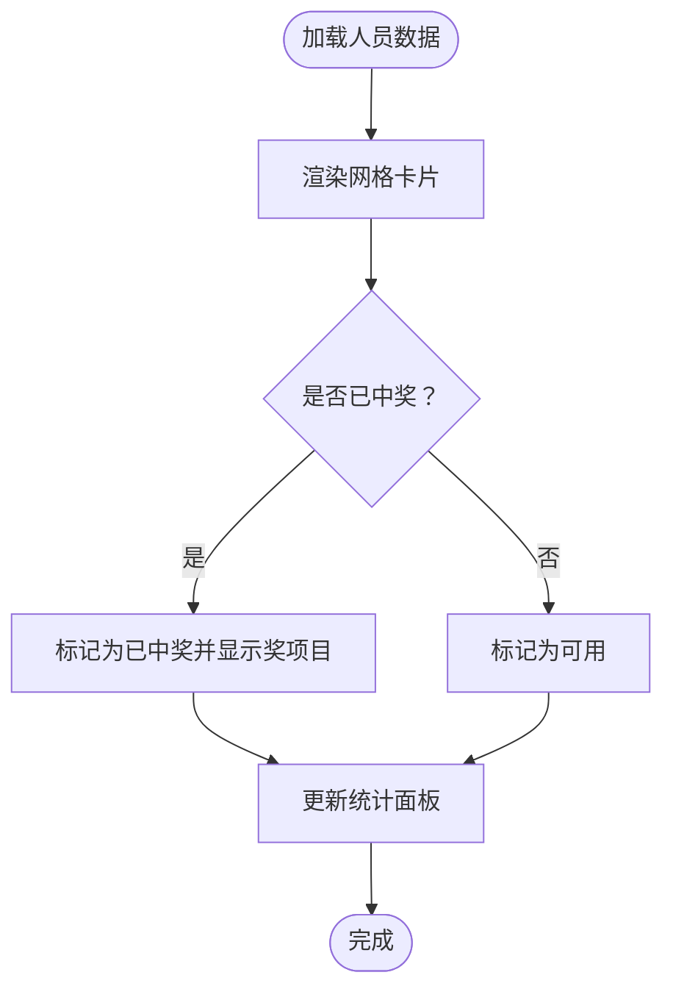
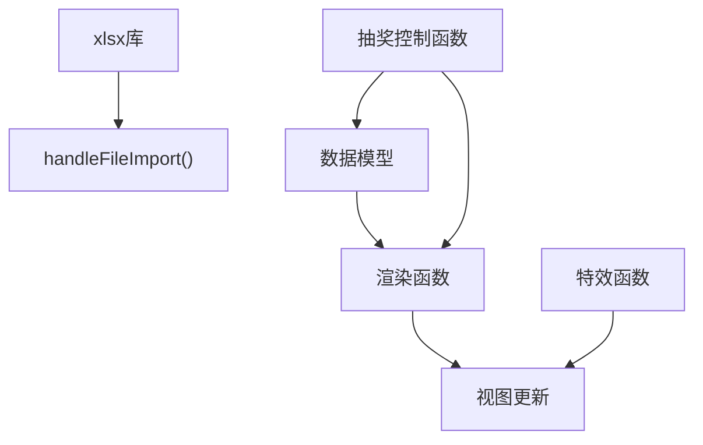

# 项目概述

<cite>
**本文引用的文件**
- [README.md](file://README.md)
- [lottery.html](file://lottery.html)
</cite>

## 目录
1. [引言](#引言)
2. [项目结构](#项目结构)
3. [核心组件](#核心组件)
4. [架构总览](#架构总览)
5. [详细组件分析](#详细组件分析)
6. [依赖分析](#依赖分析)
7. [性能考虑](#性能考虑)
8. [故障排查指南](#故障排查指南)
9. [结论](#结论)
10. [附录](#附录)

## 引言
本项目是一个“年会抽奖系统”，定位为一个单文件前端应用，旨在为企业年会等现场活动提供即时、便捷、无需后端支持的抽奖体验。系统通过 HTML、CSS 和 JavaScript 的纯前端技术栈实现，具备奖项管理、人员导入、抽奖流程控制以及中奖记录展示等核心功能，同时提供丰富的视觉效果与交互反馈，提升现场氛围与用户体验。

- 核心目的：在企业年会等场合快速组织抽奖，简化流程，降低技术门槛。
- 应用场景：年会现场、团建活动、会议互动等需要即时抽取幸运用户的场合。
- 目标用户：活动组织者、主持人、现场工作人员及参会员工。

## 项目结构
该项目采用单文件架构，所有功能集中在单一 HTML 文件中，包含：
- 结构层（HTML）：页面布局、容器与控件定义。
- 样式层（CSS）：响应式布局、动画效果、主题样式。
- 行为层（JavaScript）：数据模型、业务逻辑、事件处理与 DOM 更新。

**图表来源**
- [lottery.html](file://lottery.html#L590-L1117)

## 核心组件
- 奖项管理模块：支持增删改奖项、设置奖项数量与奖品名称，并实时渲染到左侧边栏。
- 人员导入模块：支持 TXT 文本文件与 Excel (.xlsx/.xls) 文件导入，自动去重并建立可抽取名单。
- 抽奖流程控制模块：提供开始/停止按钮，实现滚动展示与最终中奖确认，支持多轮次按奖项顺序进行。
- 中奖记录展示模块：右侧边栏分组展示各奖项的中奖者列表与奖品信息。
- 参会人员展示模块：中间区域网格化展示所有参会人员，区分“可用”与“已中奖”状态。
- 统计与提示模块：实时统计总人数、剩余人数、已中奖人数；在关键节点给出提示与确认。

**章节来源**
- [lottery.html](file://lottery.html#L620-L667)
- [lottery.html](file://lottery.html#L670-L1117)

## 架构总览
系统采用“单页前端应用”模式，所有状态与逻辑集中于浏览器端，通过事件驱动的方式更新视图。初始化阶段加载默认奖项与示例人员数据，随后由用户操作触发功能函数，完成数据更新与 DOM 渲染。

**图表来源**
- [lottery.html](file://lottery.html#L903-L1062)

## 详细组件分析

### 奖项管理
- 功能要点
  - 新增/删除奖项：动态增删奖项目，支持修改名称、数量与奖品名称。
  - 实时渲染：将奖项列表渲染到左侧边栏，便于配置与核对。
  - 顺序推进：按奖项顺序进行抽取，自动跳过已抽完的奖项。
- 关键实现路径
  - 奖项列表渲染与交互：[renderPrizes](file://lottery.html#L724-L738)
  - 新增/删除/更新奖项：[addPrize](file://lottery.html#L741-L744)、[removePrize](file://lottery.html#L756-L761)、[updatePrize](file://lottery.html#L747-L753)
  - 当前奖项信息更新：[updateCurrentPrizeInfo](file://lottery.html#L877-L901)

**图表来源**
- [lottery.html](file://lottery.html#L724-L761)

**章节来源**
- [lottery.html](file://lottery.html#L724-L761)
- [lottery.html](file://lottery.html#L877-L901)

### 人员导入
- 支持格式：.txt（每行一个姓名）、.xlsx/.xls（第一列作为姓名）
- 导入流程：读取文件 -> 解析内容 -> 去重 -> 建立可抽取名单 -> 重置中奖状态 -> 更新统计与视图
- 错误处理：空文件、格式不支持、Excel 解析异常均给出提示

**图表来源**
- [lottery.html](file://lottery.html#L763-L834)
- [lottery.html](file://lottery.html#L800-L828)

**章节来源**
- [lottery.html](file://lottery.html#L763-L834)
- [lottery.html](file://lottery.html#L800-L828)

### 抽奖流程控制
- 启动/停止：根据 isRolling 状态切换滚动与停止逻辑
- 滚动算法：定时器随机选取剩余人员，持续更新显示区
- 中奖确认：停止时保存中奖者、移除已中奖者、更新统计与历史
- 奖项推进：当某奖项抽满后自动推进到下一个奖项

**图表来源**
- [lottery.html](file://lottery.html#L903-L990)
- [lottery.html](file://lottery.html#L927-L990)

**章节来源**
- [lottery.html](file://lottery.html#L903-L990)

### 中奖记录展示
- 分组展示：按奖项名称分组，显示获奖序号与姓名
- 奖品信息：若设置奖品名称，会在对应组中显示
- 空态提示：无中奖记录时显示友好提示

**图表来源**
- [lottery.html](file://lottery.html#L1006-L1029)

**章节来源**
- [lottery.html](file://lottery.html#L1006-L1029)

### 参会人员展示与统计
- 网格化展示：按屏幕宽度自适应列数，支持横向滚动查看更多
- 状态区分：已中奖人员卡片高亮，标注对应奖项
- 统计面板：总人数、剩余人数、已中奖人数实时更新

**图表来源**
- [lottery.html](file://lottery.html#L847-L875)
- [lottery.html](file://lottery.html#L836-L845)

**章节来源**
- [lottery.html](file://lottery.html#L836-L875)

### 视觉与交互增强
- 装饰效果：背景飘落金币、中奖烟花爆炸动画，提升节日氛围
- 响应式设计：适配大屏、平板与手机，保证在不同设备上的可读性与可操作性
- 动画与过渡：标题发光、卡片弹跳、按钮悬停阴影等细节优化

**章节来源**
- [lottery.html](file://lottery.html#L1-L110)
- [lottery.html](file://lottery.html#L565-L588)
- [lottery.html](file://lottery.html#L1064-L1104)

## 依赖分析
- 外部库依赖
  - xlsx：用于解析 Excel 文件，支持 .xlsx/.xls 格式
- 内部依赖关系
  - 数据模型（prizes、participants、remainingParticipants、winners、currentPrizeIndex、isRolling、rollingInterval、currentRollingName）
  - 功能函数之间存在调用关系：initDefaultPrizes/initDefaultParticipants -> updateCurrentPrizeInfo -> startLottery/stopLottery -> displayRollingNames/renderWinnerHistory/updateStats/renderParticipantList

**图表来源**
- [lottery.html](file://lottery.html#L670-L671)
- [lottery.html](file://lottery.html#L763-L834)
- [lottery.html](file://lottery.html#L903-L1062)
- [lottery.html](file://lottery.html#L1064-L1104)

**章节来源**
- [lottery.html](file://lottery.html#L670-L671)
- [lottery.html](file://lottery.html#L763-L834)
- [lottery.html](file://lottery.html#L903-L1062)
- [lottery.html](file://lottery.html#L1064-L1104)

## 性能考虑
- 数据规模
  - 默认示例数据为 100 人，导入文件建议控制在合理范围内，避免过多数据导致渲染卡顿
- 渲染策略
  - 使用网格布局与虚拟滚动思想（按需渲染），减少一次性渲染大量 DOM 节点
- 动画与特效
  - 烟花与金币动画在中奖时触发，数量可控，避免长时间运行造成性能压力
- 事件与定时器
  - 抽奖滚动使用定时器，停止时及时清理，防止内存泄漏与资源占用

## 故障排查指南
- Excel 文件解析失败
  - 现象：提示“Excel 文件解析失败，请确保文件格式正确！”
  - 排查：检查文件是否为 .xlsx/.xls；确认第一列为姓名；避免空表或包含非文本内容
  - 参考路径：[handleFileImport](file://lottery.html#L792-L827)
- TXT 文件无有效姓名
  - 现象：提示“文件中没有找到有效的姓名！”
  - 排查：确认每行仅包含一个姓名，去除多余空白字符
  - 参考路径：[handleFileImport](file://lottery.html#L770-L791)
- 不支持的文件格式
  - 现象：提示“不支持的文件格式，请选择 .txt 或 .xlsx/.xls 文件！”
  - 排查：更换为受支持的文件类型
  - 参考路径：[handleFileImport](file://lottery.html#L828-L831)
- 抽奖前未设置奖项或未导入人员
  - 现象：点击开始按钮弹出提示
  - 排查：先在“奖项设置”中添加奖项，在“参与人员”中导入人员
  - 参考路径：[toggleLottery](file://lottery.html#L904-L925)
- 所有人员已抽取完毕
  - 现象：提示“所有人员已抽取完毕！”
  - 排查：重置系统或补充人员
  - 参考路径：[toggleLottery](file://lottery.html#L915-L918)

**章节来源**
- [lottery.html](file://lottery.html#L770-L831)
- [lottery.html](file://lottery.html#L904-L925)

## 结论
本项目以“轻量化、易部署、强交互”为核心设计理念，通过单文件前端技术实现完整的年会抽奖闭环。系统覆盖了从奖项配置、人员导入、滚动抽取到中奖展示的全流程，并辅以丰富的视觉效果与良好的用户体验。其无需后端支持的特性，使其在年会等临时场景中具有极高的实用性与可移植性。

## 附录

### 初始化默认行为说明
- 默认奖项
  - 系统启动时自动创建若干默认奖项（如三等奖、二等奖、一等奖、特等奖），并设置相应名额与奖品名称
  - 参考路径：[initDefaultPrizes](file://lottery.html#L682-L691)
- 示例人员数据
  - 自动生成 100 个示例姓名，确保唯一性并补齐至 100 人
  - 参考路径：[initDefaultParticipants](file://lottery.html#L693-L721)
- 页面加载初始化
  - 页面加载完成后执行初始化、渲染与特效创建
  - 参考路径：[window.onload](file://lottery.html#L1106-L1114)

**章节来源**
- [lottery.html](file://lottery.html#L682-L721)
- [lottery.html](file://lottery.html#L1106-L1114)